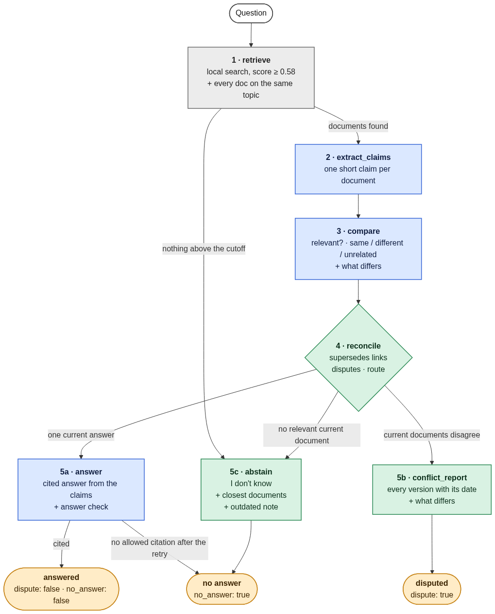

# RAG over conflicting documents

A question-answering system over made-up company documents, where some documents disagree and
some are old and replaced by newer ones. It runs on three separate datasets: **Larkfield Motors**,
a factory where the system advises people on the production line (28 documents, the default),
**Helios Dynamics**, a drone maker (40), and **Brightwater Ferries**, a ferry company (30).

## What it does

- **One current answer** → answers, citing every document that gives it.
- **Documents disagree** → shows **every** version with its creation date and what differs. It
  never picks one.
- **An old document is replaced** → answers from the newer one and shows the old one as
  "outdated". If only the old one answers, it says "I don't know" and still shows the outdated
  note.
- **Nothing answers** → says "I don't know" and lists the closest documents.

The main rule: only an explicit `supersedes` link in the document metadata can make one source
win. A newer date never does.

## How it works



A LangGraph state graph. Blue = an LLM call, green = plain Python, grey = local search (no model).

| node | what it does | done by |
|---|---|---|
| `retrieve` | vector search (score ≥ 0.58, at most 0.10 below the best hit), then every document with the same topic, so both sides of a dispute are seen. Topics go in whole, best hit first, up to 10 documents; a topic is never split | local embeddings + Qdrant |
| `extract_claims` | one short claim per document: only the part that answers the question | LLM |
| `compare` | which claims answer the question; for each pair of current documents: same, different or unrelated, and what differs | LLM |
| `reconcile` | applies `supersedes` links, keeps the disputes between current documents, picks the route | Python |
| `answer` | a cited answer written from the claims; a second LLM call checks it (one retry; if it still cites no allowed document: "I don't know") | LLM |
| `conflict_report` | every version with its creation date, and what differs | Python |
| `abstain` | "I don't know", with the closest documents | Python |

The LLM never decides which document is right. The dispute report, the outdated note and
"I don't know" are built by code, so no model can blur "30 vs 45 minutes" into "30 to 45
minutes". Every step with real traces: [`docs/pipeline.md`](docs/pipeline.md).

## Examples

The 5 questions of the Larkfield LangSmith dataset `larkfield_small_reformated`. The reference is
the expected output from `data/larkfield/questions.json`; the output is from a real run
(2026-10-01), shortened. All five passed every check.

| question | reference (expected) | output |
|---|---|---|
| Who do I call when a machine on my line breaks down? | **answered**: Call maintenance on extension 4400 [D23]. | **ANSWERED**: Call maintenance on extension 4400. [D23] |
| What torque should I use for the M6 motor housing bolts? | **answered**: 10 Nm [D02].<br>outdated: D01 → D02 | **ANSWERED**: Tighten the M6 motor housing bolts to 10 Nm. [D02]<br>Outdated: [D01] (created 2024-03-04) said: "… 9 Nm …" It is replaced by [D02] (created 2025-02-10). |
| How long is the meal break on an 8-hour shift? | **disputed**: D09, D10 | **DISPUTED**: [D10] Works Council wiki (created 2025-04-02): 45 minutes · [D09] HR Handbook (created 2025-01-15): 30 minutes |
| Do I have to wear safety glasses everywhere on the shop floor? | **disputed**: D16, D17 | **DISPUTED**: [D16] EHS Manual (created 2025-02-01): at all times, at every station · [D17] Line 1 team brief (created 2025-05-12): only at the press and grinding stations, optional at the assembly benches |
| Does the plant have a gym for employees? | **abstained** (no answer) | **ABSTAINED**: I don't know. Closest documents: D28, D09, D22 |

The full output of the meal-break question, as printed (the step trace after it is left out):

```
$ python main.py ask "How long is the meal break on an 8-hour shift?"
STATUS: DISPUTED
Question: How long is the meal break on an 8-hour shift?
The sources disagree. Both versions:
  - [D10] Works Council wiki (created 2025-04-02): On an 8-hour shift the meal break is 45 minutes.
  - [D09] HR Handbook (created 2025-01-15): On an 8-hour shift you get a 30-minute meal break.
What differs:
  - [D10] (created 2025-04-02) vs [D09] (created 2025-01-15): D10 says 45 minutes, while D09 says 30
    minutes.
Neither document is marked as replacing the other; a newer date alone does not settle it.
```

## Quick start

Python 3.12, CPU only, and an OpenRouter key.

```bash
python3.12 -m venv .venv && source .venv/bin/activate
pip install -r requirements.txt
cp .env.example .env          # put your OpenRouter key in LLM_API_OR
python main.py ask "What torque should I use for the M6 motor housing bolts?"
python main.py --dataset helios ask "How many days per week can employees work remotely?"
```

The first run downloads the embedding model once (65 MB) and builds the index. Setup and
problems: [`docs/setup.md`](docs/setup.md). Switching datasets:
[`docs/datasets.md`](docs/datasets.md#switching).

## Commands

```
python main.py config            # print every setting (secrets hidden)
python main.py index [--reindex] # build or refresh the Qdrant collection
python main.py search "<q>"      # retrieval test, no model calls
python main.py llm-test          # one structured-output call through OpenRouter
python main.py ask "<q>"         # run the full pipeline on one question
python main.py demo [--all]      # run the 5 demo questions (--all: every question)
python eval.py                   # PASS/FAIL for all questions; exit code 1 on any FAIL or error
python main.py --dataset helios ask "<q>"        # any command on another dataset (or brightwater)
LANGSMITH_TRACING=true python eval.py --langsmith-dataset <name>   # experiment on a LangSmith dataset
python -m pytest                 # unit tests, no model calls (pip install -r requirements-dev.txt)
langgraph dev                    # LangGraph Studio on 127.0.0.1:2024 (pip install -r requirements-dev.txt)
```

Every setting lives in `config.py` and can be changed in `.env` or the shell, under the same name.
Two exceptions: the OpenRouter key is read from `LLM_API_OR` (or `OPENROUTER_API_KEY`), and the
per-dataset values (corpus folder, questions file, collection) all follow `DATASET`. LangSmith
tracing is optional and off by default (`LANGSMITH_TRACING=true` with `LANGSMITH_API_KEY` in
`.env`).

## Evaluation

`python eval.py` runs every question of a dataset through the pipeline and checks it: Larkfield
20/20, Helios 35/35, Brightwater 26/26. Disputes and "I don't know" are checked in code (the
`dispute` and `no_answer` flags and the linked documents); answers also by an LLM grader against
the reference answer. The reference has the same shape as the output, so in LangSmith the two
line up side by side, and each LangSmith dataset is split by outcome (`one_answer`, `dispute`,
`no_answer`). Details: [`docs/evaluation.md`](docs/evaluation.md).

## Documentation

| file | what |
|---|---|
| [`docs/architecture.md`](docs/architecture.md) | the big picture: parts, modules, output, settings, failure handling (read first) |
| [`docs/pipeline.md`](docs/pipeline.md) | every step in detail, with real traces |
| [`docs/decisions.md`](docs/decisions.md) | every design decision with its reason |
| [`docs/datasets.md`](docs/datasets.md) | the three datasets, switching, adding one, the Larkfield and Brightwater documents |
| [`docs/corpus.md`](docs/corpus.md) | the 40 Helios documents and the rules all documents follow |
| [`docs/evaluation.md`](docs/evaluation.md) | the questions, the checks, the results, LangSmith |
| [`docs/setup.md`](docs/setup.md) | install, settings, LangSmith, Studio, server mode, problems |
| [`docs/research.md`](docs/research.md), [`docs/models.md`](docs/models.md) | published work behind the design; model choice |
| [`STATUS.md`](STATUS.md) | what is done, what is next, known issues |
