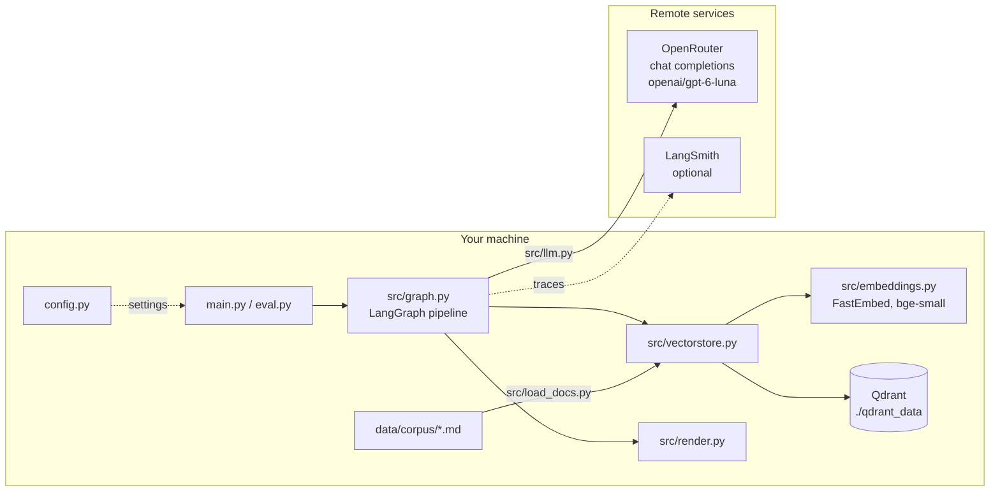

# Architecture

This page shows the parts of the system and how they fit together. For a step-by-step walk
through one question, see `pipeline.md`.

## Parts

## Modules

| file | job |
|---|---|
| `config.py` | Every setting. Reads `.env` once. No other module reads `os.environ`. |
| `main.py` | The command line: `config`, `index`, `search`, `llm-test`, `ask`, `demo`. |
| `eval.py` | Runs the questions in `questions.json`, prints PASS/FAIL, optionally runs a LangSmith experiment. |
| `langgraph.json`, `src/studio.py` | Entry point for LangGraph Studio (`langgraph dev`): builds the index if needed and exposes the graph as `helios_rag`. |
| `src/load_docs.py` | Reads the markdown files with frontmatter. Checks ids, dates, `supersedes` targets and that a doc and the doc it replaces share a topic. Gives the doc map and the corpus hash. |
| `src/embeddings.py` | A small `Embeddings` class around FastEmbed, so LangChain and Qdrant can use it. |
| `src/vectorstore.py` | One Qdrant client per process. Builds or reuses the collection. `retrieve()` does search, cutoff and adds related docs. |
| `src/llm.py` | The `ChatOpenAI` client for OpenRouter. `structured()` (strict JSON schema). Counts tokens and cost. |
| `src/schemas.py` | Pydantic models: `Claims`, `Comparison`, `Answer`, `AnswerCheck`, `FinalOutput`. |
| `src/prompts.py` | The prompt texts. |
| `src/graph.py` | `RAGState`, the steps, the rules in `reconcile`, the citation check, and `build_graph()`. |
| `tests/` | Unit tests (`python -m pytest`, no model calls): the graph rules (`reconcile`, reading the LLM's comparison, finding citations) on the real corpus, and the corpus checks in `load_docs`. |
| `src/render.py` | Turns a `FinalOutput` into terminal text. |

## Who does what

| job | done by | never done by |
|---|---|---|
| find candidate documents | Qdrant + local embeddings | any remote model |
| say what each document claims | LLM (structured output) | – |
| is this document relevant? do two claims give different answers, and what differs? | LLM (structured output) | – |
| which document wins | Python, from `supersedes` links only | any model |
| dispute report, outdated note, "I don't know" | Python | any model |
| final cited answer | LLM, from the claims only; Python checks the citations, a second LLM call checks the facts | – |

## Data

- Documents: `data/corpus/Dxx_name.md`, markdown with frontmatter
  `id, title, source, date, topic, supersedes`.
- Qdrant collection `helios_docs`: one point per document. Vector: 384 numbers, cosine.
  Payload: `page_content` and `metadata` (the frontmatter). Qdrant is only used for the search;
  the related docs are taken from the corpus in memory.
- `qdrant_data/corpus.sha256`: hash of the corpus files at the last index build. If it changes,
  the index is rebuilt.

## Settings

All in `config.py`, each one can be set in `.env` or the shell with the same name. The main ones:
`LLM_MODEL`, `TOP_K`, `SCORE_THRESHOLD`, `SCORE_MARGIN`, `QDRANT_MODE`, `LANGSMITH_TRACING`. Run `python main.py config` to see all of
them with the values in use.

## Failure handling

| what fails | what happens |
|---|---|
| no document scores above the cutoff | abstain at once, no model call |
| the LLM reply cannot be parsed, or the LLM call fails | the run stops with a one-line `ERROR (...)` message, exit code 2 |
| the LLM leaves a pair out of its comparison | the pair counts as unrelated, with a warning |
| the answer check finds a problem | ask once more with the problems as the fix; then keep the answer with a note that lists them |
| the answer cites no allowed doc, or a doc that is not allowed | ask once more; then leave out the ids that are not allowed, and abstain if no allowed id is left |
| Qdrant folder locked by another process | clear error message with three ways out |
