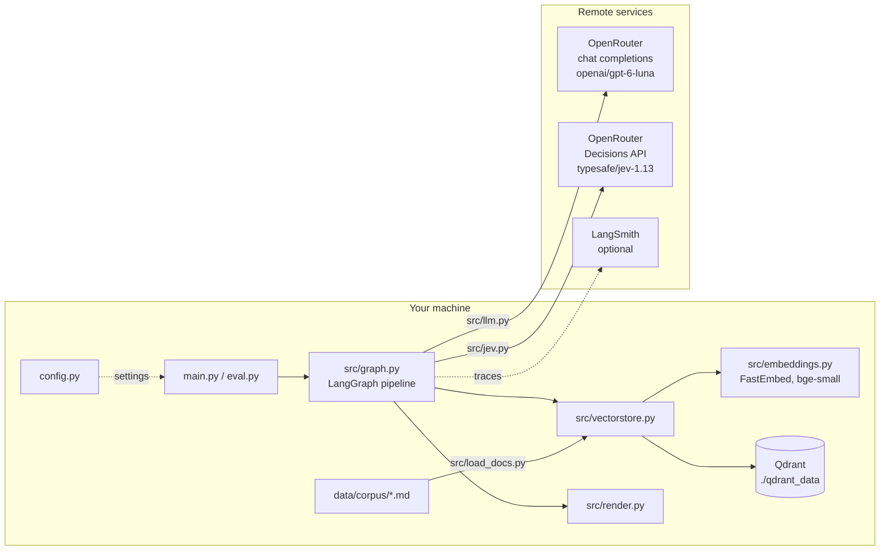

# Architecture

This page shows the parts of the system and how they fit together. For a step-by-step walk
through one question, see `pipeline.md`.

## Parts

## Modules

| file | job |
|---|---|
| `config.py` | Every setting. Reads `.env` once. No other module reads `os.environ`. |
| `main.py` | The command line: `config`, `index`, `search`, `llm-test`, `jev-test`, `ask`, `demo`. |
| `eval.py` | Runs the questions in `questions.json`, prints PASS/FAIL, optionally runs a LangSmith experiment. |
| `langgraph.json`, `src/studio.py` | Entry point for LangGraph Studio (`langgraph dev`): builds the index if needed and exposes the graph as `helios_rag`. |
| `src/load_docs.py` | Reads the markdown files with frontmatter. Checks ids, dates and `supersedes` targets. Gives the doc map and the corpus hash. |
| `src/embeddings.py` | A small `Embeddings` class around FastEmbed, so LangChain and Qdrant can use it. |
| `src/vectorstore.py` | One Qdrant client per process. Builds or reuses the collection. `retrieve()` does search, cutoff and adds related docs. |
| `src/llm.py` | The `ChatOpenAI` client for OpenRouter. `structured()` with fallbacks. Counts tokens and cost. |
| `src/jev.py` | The Decisions API client. Builds the questions, parses the answers into relevance and pairs. |
| `src/schemas.py` | Pydantic models: `Claims`, `Answer`, `Assessment`, `FinalOutput` and the Jev request and response. |
| `src/prompts.py` | The prompt texts. |
| `src/graph.py` | `RAGState`, the steps, the rules in `reconcile`, and `build_graph()`. |
| `src/render.py` | Turns a `FinalOutput` into terminal text. |

## Who does what

| job | done by | never done by |
|---|---|---|
| find candidate documents | Qdrant + local embeddings | any remote model |
| say what each document claims | LLM (structured output) | – |
| is this document relevant? do two claims disagree? | Jev (LLM if Jev fails) | – |
| which document wins | Python, from `supersedes` links only | any model |
| dispute report, outdated note, "I don't know" | Python | any model |
| final cited answer | LLM, from the checked claims only; then Python checks the citations and looks for numbers the documents disagree on | – |

## Data

- Documents: `data/corpus/Dxx_name.md`, markdown with frontmatter
  `id, title, source, date, topic, supersedes`.
- Qdrant collection `helios_docs`: one point per document. Vector: 384 numbers, cosine.
  Payload: `page_content` and `metadata` (the frontmatter). Keyword indexes on `metadata.topic`
  and `metadata.id`.
- `qdrant_data/corpus.sha256`: hash of the corpus files at the last index build. If it changes,
  the index is rebuilt.

## Settings

All in `config.py`, each one can be set in `.env` or the shell with the same name. The main ones:
`LLM_MODEL`, `JUDGE` (`jev` or `llm`), `TOP_K`, `SCORE_THRESHOLD`, `JEV_RELEVANT_P`,
`JEV_DISAGREE_P`, `QDRANT_MODE`, `LANGSMITH_TRACING`. Run `python main.py config` to see all of
them with the values in use.

## Failure handling

| what fails | what happens |
|---|---|
| no document scores above the cutoff | abstain at once, no model call |
| `json_schema` structured output not supported | try `function_calling`, then `json_mode` + Pydantic (all three tested in M5) |
| claims cannot be parsed at all | use the first 300 characters of each doc (headings removed) as its claim |
| Jev call fails (error, timeout, bad format) | the LLM judges with structured output; `judge_used=llm` |
| the answer cites a doc that is not allowed | drop it; if none left, ask once more; then abstain |
| Qdrant folder locked by another process | clear error message with three ways out |
| Jev fails and `JUDGE_FALLBACK=none` | the run stops with a one-line `ERROR (JevError)` message, exit code 2 |
| every structured-output method fails | claims = start of each doc (judge still runs); answer = plain text with `[Dxx]` citations picked out of it (tested in M5) |
