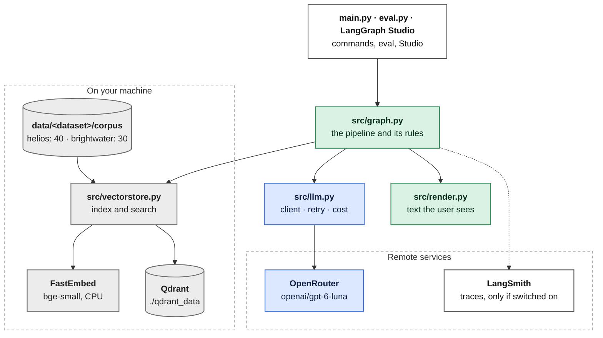
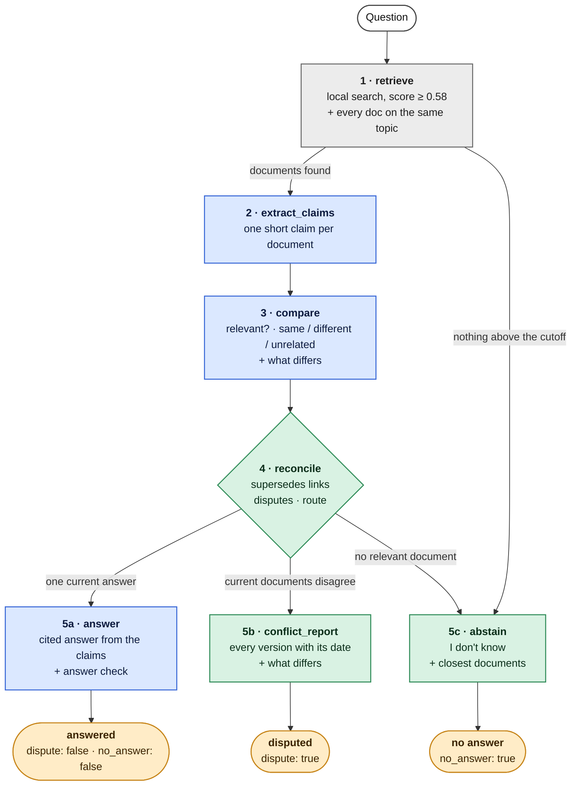

# Architecture

This page shows the parts of the system, what each part does, and how they fit together. For a
step-by-step walk through one question with real traces, see [`pipeline.md`](pipeline.md).

## In short

A question goes through a fixed pipeline (a LangGraph state graph). Local code finds the
documents about the question. One language model (the LLM) reads them: it writes one short
claim per document, compares the claims, writes the answer, and checks the answer. Plain Python
then decides the outcome from fixed rules. It is the only part that decides which document wins,
and only an explicit `supersedes` link can make one win.

There are three outcomes: **answered** (one current answer, with sources), **disputed** (two
current documents disagree: both versions are shown, no answer), and **abstained** ("I don't
know").

## The parts

Colours: **blue** = the LLM (client and model) · **green** = plain Python · **grey** = local search
and storage, no model · **white** = entry points and optional tracing.

Only two things leave your machine: the LLM calls to OpenRouter, and traces to LangSmith if you
switch tracing on. Search and embeddings run locally.

## One question, start to finish

Colours: **blue** = an LLM call · **green** = plain Python · **grey** = local search, no model ·
**orange** = the three outcomes (with the `dispute` and `no_answer` flags).

Each step reads some fields of one shared state and writes others. The state and every step are
described in [`pipeline.md`](pipeline.md).

## Who does what

The system keeps reading (a model's job) apart from deciding (plain code's job).

| job | done by | never done by |
|---|---|---|
| find candidate documents | Qdrant + local embeddings | any remote model |
| say what each document claims about the question | LLM (`extract_claims`) | – |
| say if a claim answers the question, and if two claims give the same answer | LLM (`compare`) | – |
| say *what* differs between two claims | LLM (`compare`), one sentence | – |
| decide which document wins | Python, from `supersedes` links only | any model |
| decide the outcome (answered / disputed / abstained) | Python (`reconcile`) | any model |
| dispute report, outdated note, "I don't know", all dates | Python | any model |
| final cited answer | LLM, from the claims only | – |
| check the answer | Python (citations) + a second LLM call (facts) | – |

Why this split: a model can soften "16 weeks vs 12 weeks" into "about 12 to 16 weeks", or pick
the newer document because it is newer. So a model never writes the dispute report and never
settles a dispute. It only reads and compares, and everything it says is shown next to the
source it came from.

## Modules

| file | job |
|---|---|
| `config.py` | Every setting, read once from `.env` or the shell. No other module reads `os.environ`. |
| `main.py` | The command line: `config`, `index`, `search`, `llm-test`, `ask`, `demo`. Prints cost after every run; turns known errors into one-line messages. |
| `eval.py` | Runs the questions of one dataset (`data/<name>/questions.json`), checks each result, prints PASS/FAIL. Optionally runs the same checks as a LangSmith experiment. |
| `src/load_docs.py` | Reads the markdown files and their frontmatter. Checks ids, dates, `supersedes` targets, and that a document and the one it replaces share a topic. Gives `doc_map()` (id → document) and the corpus hash. |
| `src/embeddings.py` | A small LangChain `Embeddings` class around FastEmbed (`BAAI/bge-small-en-v1.5`, CPU). |
| `src/vectorstore.py` | One Qdrant client per process. Builds the collection, or reuses it while the corpus hash is unchanged. `retrieve()`: search, score cutoff and margin, add every doc on the same topics, cap at 10. |
| `src/llm.py` | The `ChatOpenAI` client for OpenRouter. `structured(schema, messages)` asks for a Pydantic object (strict JSON schema). Counts tokens and cost; `record_spend()` keeps the running total in `.spend.json`. |
| `src/prompts.py` | The four prompts: extract claims, compare, answer, check the answer. |
| `src/schemas.py` | Pydantic models: what the LLM must return (`Claims`, `Comparison`, `Answer`, `AnswerCheck`) and the final output (`FinalOutput` with `Citation` and `OutdatedNote`). |
| `src/graph.py` | The state (`RAGState`), the seven steps, the rules in `reconcile`, the "replaces" chains, the citation check, and `build_graph()` / `run()`. |
| `src/render.py` | Turns a `FinalOutput` into the text the user sees, plus the optional trace. |
| `src/studio.py`, `langgraph.json` | Entry point for LangGraph Studio (`langgraph dev`): builds the index if needed and exposes the graph as `helios_rag`. |
| `tests/` | Unit tests, no model calls (`python -m pytest`). |

How a command flows through the code: `main.py ask` → `vectorstore.ensure_index()` →
`graph.run(question)` → the steps in `graph.py`, which call `vectorstore.retrieve()`,
`llm.structured()` with the prompts from `prompts.py` and the schemas from `schemas.py` → the last
step builds a `FinalOutput` and `render.render()` turns it into text → `main.py` prints it and
the cost.

## Data

- **Datasets:** `data/<name>/` holds `corpus/` and `questions.json`. `larkfield` (default),
  `helios` and `brightwater`; pick one with `--dataset <name>` or `DATASET`. See [`datasets.md`](datasets.md).
- **Documents:** `data/<name>/corpus/Dxx_name.md`, markdown with frontmatter
  `id, title, source, date, topic, supersedes`. `date` is the day the document was created and is
  shown next to the document everywhere. `supersedes` names the document this one replaces. See
  [`corpus.md`](corpus.md).
- **Qdrant collection** `<name>_docs` (`larkfield_docs`, `helios_docs`, `brightwater_docs`): one point per document. Vector: 384 numbers, cosine.
  Payload: the text and the frontmatter. Qdrant is only used for the search; the related
  documents are taken from the corpus in memory.
- **`qdrant_data/<name>_docs.sha256`:** hash of the dataset's corpus files at the last index build. If a
  document changes, the next `index`, `search`, `ask`, `demo` or `eval.py` rebuilds the index.
- **`.spend.json`:** running total of money spent by this app (not committed).

## Output

Every run ends in one `FinalOutput`:

| field | answered | disputed | abstained |
|---|---|---|---|
| `status` | `answered` | `disputed` | `abstained` |
| `answer` | the cited answer (ids that are not allowed stay in the text but are left out of `citations`) | – | – |
| `citations` | the cited docs, plus every doc that agrees with one of them: id, source, created date, claim | – | – |
| `versions` | – | each side: id, source, created date, claim | – |
| `differences` | – | "[D03] (created …) vs [D04] (created …): what differs" | – |
| `outdated` | replaced docs: old id and date, old claim, new id and date | same | – |
| `dispute` | false | **true** | false |
| `no_answer` | false | false | **true** |
| `reason` | a note if the answer check still found a problem | "Neither document is marked as replacing the other…" | why, and the closest docs with dates and scores |

The same result is also kept as text in the state field `output`, which is what the CLI prints
and what Studio shows.

## Settings

All in `config.py`; each one can be set in `.env` or the shell with the same name.
`python main.py config` prints them all with the values in use.

| group | settings (default) |
|---|---|
| LLM | `LLM_MODEL` (`openai/gpt-6-luna`), `LLM_REASONING_EFFORT` (`low`), `LLM_MAX_TOKENS` (1500), `LLM_TIMEOUT_S` (90), `LLM_MAX_RETRIES` (3), `LLM_REQUIRE_PARAMETERS` (true), price per million tokens for the cost estimate |
| retrieval | `TOP_K` (6), `SCORE_THRESHOLD` (0.58), `SCORE_MARGIN` (0.10), `MAX_CONTEXT_DOCS` (10), `EMBEDDING_MODEL` |
| dataset | `DATASET` (`helios`); sets the corpus folder, the questions file, the Qdrant collection and the LangSmith dataset name |
| Qdrant | `QDRANT_MODE` (`embedded` or `server`), `QDRANT_PATH`, `QDRANT_URL` |
| LangSmith | `LANGSMITH_TRACING` (false), `LANGSMITH_API_KEY`, `LANGSMITH_PROJECT` |
| eval | `EVAL_JUDGE_MODEL` (the grader's model; default: `LLM_MODEL`) |
| output and budget | `SHOW_SCORES` (true: print the trace), `LOG_LEVEL`, `BUDGET_USD` (4.0) |

The OpenRouter key is read from `LLM_API_OR`.

## Failure handling

| what fails | what happens |
|---|---|
| no document scores above the cutoff | abstain at once, no model call |
| no retrieved document has a claim | abstain, no compare call |
| the LLM leaves a pair out of its comparison | the pair counts as unrelated, with a warning |
| the answer cites no allowed doc, or a doc that is not allowed | ask once more; then leave out the ids that are not allowed, and abstain if no allowed id is left |
| the answer check finds a problem | ask once more with the problems as the fix; then keep the answer with a note that lists them |
| OpenRouter answers HTTP 200 with an error inside instead of a reply (e.g. a short upstream rate limit) | wait and try again (2, 4, 8 s); then as below |
| the LLM reply cannot be parsed, or the LLM call fails | the run stops with a one-line `ERROR (...)` message (exit code 2 from `main.py`, 1 from `eval.py`); the cost so far is still recorded |
| a document has bad frontmatter | `ERROR (CorpusError)` naming the file |
| the Qdrant folder is locked by another process | `ERROR (LockedStorageError)` with two ways out |

## Tests

- **Unit tests** (`python -m pytest`, free, no model calls): the rules in `reconcile`, reading the
  LLM's comparison, the "replaces" chains, finding citations, the dates in the output, and the
  corpus checks. They use the real corpus.
- **Eval** (`python eval.py --dataset helios`, live, about $0.011): all 34 questions through the full pipeline,
  checking the `dispute` and `no_answer` flags and the linked documents, and, for questions with
  one answer, an LLM grader that compares the answer with a reference answer written by hand. See [`evaluation.md`](evaluation.md).
