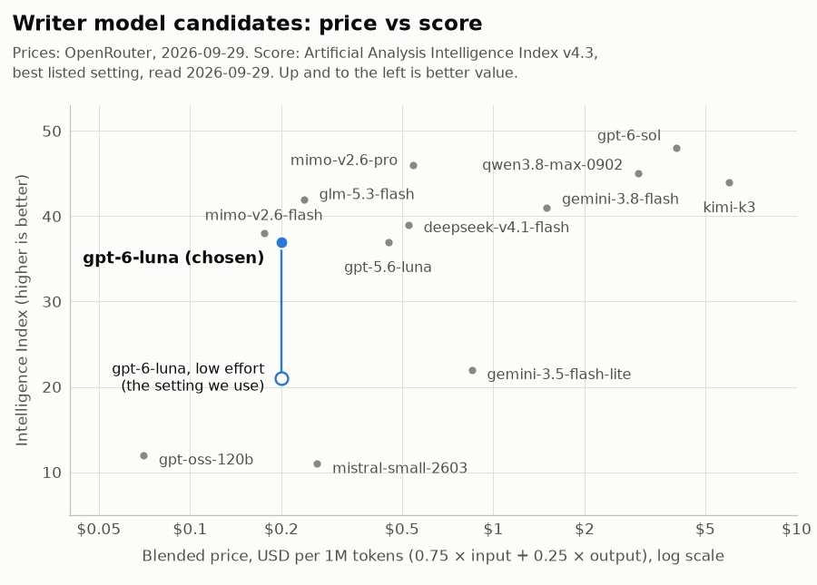

# Model comparison

Checked on 2026-09-29. This page explains why the pipeline uses `openai/gpt-6-luna`, the only
model it calls.

- Prices, context sizes and supported parameters come from the public OpenRouter model list
  (`https://openrouter.ai/api/v1/models`) and its per-model endpoint lists. Prices are in USD
  per 1 million tokens (the API gives USD per token; we multiplied by 1,000,000).
- Quality scores come from one public leaderboard: the **Artificial Analysis Intelligence
  Index** (v4.3), read on 2026-09-29. Links are at the end.

## What the text model has to do

The model has four small jobs (see [pipeline.md](pipeline.md)), all with structured output:

1. `extract_claims`: for each retrieved document, write one sentence that says what the
   document says about the question, with numbers copied exactly.
2. `compare`: say which claims answer the question and, for each pair, same / different /
   unrelated, naming both values when different.
3. `answer`: write 2 to 4 sentences, each ending with a `[Dxx]` citation.
4. The check on the answer: list facts no claim states and values the documents give
   differently.

It never decides which document is right and never writes the dispute report. So we need a model
that is cheap, follows a JSON schema, and can copy facts without changing them. We do not need
top-level reasoning.

Hard requirements: OpenRouter must list `response_format` and `structured_outputs` for the
model, and the price must leave a large margin inside the $4 budget.

## About the score

The Intelligence Index is a weighted average of 10 tests: agent tasks 30%, coding 20%,
science reasoning 20%, and general tasks (knowledge, documents, long context) 30%. It measures
hard, multi-step work. Our jobs are much easier than that, so read the score as a rough guide to
general quality, not as a measure of claim extraction.

The score depends on how much the model is allowed to "think" before answering (the reasoning
setting). For example, GPT-6 Luna scores 37 at `max`, 34 at `xhigh`, 32 at `high`, 29 at
`medium`, 21 at `low` and 18 with reasoning off. When the leaderboard lists several settings
for a model, the table shows the best one, so every model is shown at its best. We run
gpt-6-luna at `low`, which scores 21.

## Candidates

All 13 candidates list both `response_format` and `structured_outputs` on OpenRouter.

| model (OpenRouter id) | input $/M | output $/M | structured output | context (tokens) | score (setting) | note |
|---|---:|---:|---|---:|---|---|
| **`openai/gpt-6-luna`** | **0.10** | **0.50** | yes | 1,050,000 | **37 (max); 21 (low)** | **chosen**; reasoning can be set from `none` to `max`; no `temperature` |
| `openai/gpt-6-sol` | 2.00 | 10.00 | yes | 1,050,000 | 48 (max) | bigger sibling; 20× the price for +11 points |
| `openai/gpt-5.6-luna` | 0.20 | 1.20 | yes | 1,050,000 | 37 (max) | previous Luna; same score at 2–2.4× the price |
| `google/gemini-3.8-flash` | 0.75 | 3.75 | yes | 1,048,576 | 41 (high) | reasoning cannot be turned off |
| `google/gemini-3.5-flash-lite` | 0.30 | 2.50 | yes | 1,048,576 | 22 | costly output for its score |
| `z-ai/glm-5.3-flash` | 0.15 | 0.50 | yes | 1,310,720 | 42 | best score near our price; reasoning always on (default `max`); 34 hosts, 7 without structured output |
| `deepseek/deepseek-v4.1-flash` | 0.30 | 1.20 | yes | 1,048,576 | 39 (max) | good and fast; 3× our input price |
| `xiaomi/mimo-v2.6-flash` | 0.14 | 0.28 | yes | 1,048,576 | 38 | cheapest good score; no `reasoning_effort` control |
| `xiaomi/mimo-v2.6-pro` | 0.435 | 0.87 | yes | 1,050,000 | 46 | best value in the mid-price range |
| `qwen/qwen3.8-max-0902` | 2.00 | 6.00 | yes | 1,000,000 | 45 | reasoning always on (default `xhigh`) |
| `moonshotai/kimi-k3` | 3.00 | 15.00 | yes | 1,048,576 | 44 (max) | most expensive in the list |
| `mistralai/mistral-small-2603` | 0.15 | 0.60 | yes | 262,144 | 11 | Mistral Small 4; cheap but weak |
| `openai/gpt-oss-120b` | 0.037 | 0.17 | yes | 131,072 | 12 (high) | cheapest; weak; open weights |

Every candidate has a score, so none is marked "n/a". The score for `openai/gpt-5.6-luna` comes
from its model page, because the leaderboard marks it as deprecated and leaves it out of the
default table.

The x axis uses a **blended price = 0.75 × input price + 0.25 × output price** per 1 million
tokens (a 3 to 1 mix of input and output tokens), on a log scale. Our own calls are even more
input-heavy (about 6 to 1), so the blended price slightly overstates models with costly output.
The blue stem shows gpt-6-luna at its best setting (filled dot) and at the `low` setting we use
(open dot). The price per token is the same for both. Only the number of reasoning tokens
changes.

## Cost of one full eval

Measured with gpt-6-luna on 2026-09-30: a full eval (34 questions, with the grader) makes about
128 LLM calls with about **90,000 input and 8,000 output tokens**. An answered question takes 4
calls (claims, compare, answer, check; 6 if the answer is retried), a disputed one 2, one where
no document has a claim 1, and one stopped at the search 0; the grader adds 1 per one-answer
question. The same token counts at each model's list price:

| model | cost of one full eval | evals that fit in $4 |
|---|---:|---:|
| `openai/gpt-oss-120b` | $0.0047 | about 850 |
| **`openai/gpt-6-luna`** | **$0.0130** (measured: $0.011) | **about 300** |
| `xiaomi/mimo-v2.6-flash` | $0.0148 | about 270 |
| `z-ai/glm-5.3-flash` | $0.0175 | about 230 |
| `mistralai/mistral-small-2603` | $0.0183 | about 220 |
| `openai/gpt-5.6-luna` | $0.0276 | about 145 |
| `deepseek/deepseek-v4.1-flash` | $0.0366 | about 110 |
| `xiaomi/mimo-v2.6-pro` | $0.0461 | about 85 |
| `google/gemini-3.5-flash-lite` | $0.0470 | about 85 |
| `google/gemini-3.8-flash` | $0.0975 | about 40 |
| `qwen/qwen3.8-max-0902` | $0.2280 | about 17 |
| `openai/gpt-6-sol` | $0.2600 | about 15 |
| `moonshotai/kimi-k3` | $0.3900 | about 10 |

Models that always reason (GLM-5.3 Flash, Qwen, Gemini 3.8 Flash) would use more output tokens
than gpt-6-luna at `low`, so their real cost would be higher. One `ask` costs about $0.0002 to
$0.0004.

## Why gpt-6-luna

- **Cheap.** $0.10 in and $0.50 out per million tokens. About $0.011 per full eval and $0.0011
  per demo run (5 questions), measured.
- **Structured output.** OpenRouter lists `response_format` and `structured_outputs`. It has 7
  endpoints (`openai`, `openai/flex`, `openai/fast`, `azure`, `azure/us`, `azure/eu`,
  `amazon-bedrock/us-east-1`). Only the Bedrock one lacks structured output, and
  `LLM_REQUIRE_PARAMETERS=true` keeps our requests off it. By contrast, GLM-5.3 Flash is served
  by 34 endpoints with different quantizations (fp4, fp8), and 7 of them lack structured output.
- **Reasoning is optional and adjustable.** Settings go from `none` to `max`. We send
  `reasoning_effort=low`. On the leaderboard's speed test, gpt-6-luna at `low` took about 5.6 s
  per full response. At `max` it took about 99 s. GLM-5.3 Flash and MiMo-V2.6-Flash, which reason
  by default, took about 55 s and 49 s.
- **Large context.** 1,050,000 tokens. We need less than 10,000.
- **Good enough for the job.** Copying one fact per document and writing a short cited answer
  does not need a top-scoring model. The eval (`python eval.py`) is the real test.

To be fair: gpt-6-luna is **not** the best score per dollar. GLM-5.3 Flash (42) and
MiMo-V2.6-Flash (38) score higher than its best (37) at about the same price, and MiMo-V2.6-Pro (46)
costs about 3 times more per run. If gpt-6-luna fails the eval, these are the first models to try.
Switching is one setting: `LLM_MODEL` in `.env`.

### Risks and what we do about them

- **No `temperature`.** OpenRouter lists no `temperature` support on any gpt-6-luna endpoint.
  `LLM_TEMPERATURE` is empty by default, so we never send it. Set it only for a model that
  supports it.
- **Low effort scores much lower.** At `low` the index score is 21, against 37 at `max`. If
  claims come out wrong, set `LLM_REASONING_EFFORT=medium` (score 29). This costs more output
  tokens but stays far inside the budget.
- **New model.** It was released on 2026-09-22. The id `openai/gpt-6-luna` points to
  `openai/gpt-6-luna-20260922` today and may move to a newer version later.
- **Cheaper option not used.** The `openai/flex` endpoint costs half ($0.05 / $0.25). We do not
  need it at this budget.

## Sources

- OpenRouter model list, read 2026-09-29: <https://openrouter.ai/api/v1/models>
- OpenRouter endpoint lists, read 2026-09-29:
  <https://openrouter.ai/api/v1/models/openai/gpt-6-luna/endpoints>,
  <https://openrouter.ai/api/v1/models/z-ai/glm-5.3-flash/endpoints>,
  <https://openrouter.ai/api/v1/models/xiaomi/mimo-v2.6-flash/endpoints>
- Artificial Analysis, LLM leaderboard (scores, speed), read 2026-09-29:
  <https://artificialanalysis.ai/leaderboards/models>
- Artificial Analysis, Intelligence Index method (v4.3.2, list of tests and weights):
  <https://artificialanalysis.ai/methodology/intelligence-benchmarking>
- Artificial Analysis model pages: <https://artificialanalysis.ai/models/gpt-6-luna>,
  <https://artificialanalysis.ai/models/gpt-6-luna-low>,
  <https://artificialanalysis.ai/models/gpt-5-6-luna>

More background on these choices: [research.md](research.md).
