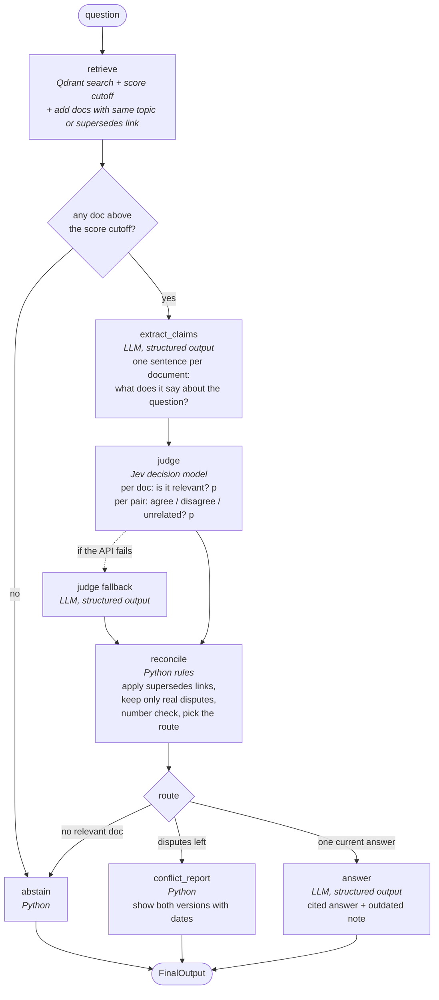

# How the agent works

The system answers a question from 20 internal documents. It never pretends to know more than
the documents say. There are three possible outcomes:

| outcome | when | what the user sees |
|---|---|---|
| **answered** | the documents give one current answer | the answer, each sentence cited `[Dxx]`, plus a note if an older version of the fact exists |
| **disputed** | two current documents give different answers and neither one officially replaces the other | both versions with document id, source and date, and *no* answer |
| **abstained** | no document answers the question | a short "I don't know" plus the closest documents it looked at |

The main rule: **only an explicit `supersedes` link in the document metadata can make one source
win.** A newer date, a more official-looking source, or the language model's opinion never does.

## The graph

The pipeline is a LangGraph state graph. Each box is a step that reads some fields of a shared
state and writes others. Diamonds are decisions about where to go next.



Two different models are used, and each has one job:

- **The LLM** (`openai/gpt-6-luna` through OpenRouter) writes text. It pulls out claims and
  writes the final answer. It is never asked "which document is right?" and it never writes the
  dispute report. So it cannot blur a contradiction into a vague middle ground.
- **Jev** (`typesafe/jev-1.13` through OpenRouter's Decisions API) makes decisions. It only
  answers yes/no and multiple-choice questions ("is this document relevant?", "do these two claims
  agree, disagree, or is one unrelated?") and returns a probability for each. It cannot write
  text at all.

Everything that turns those decisions into an outcome is plain Python with fixed rules.

## The state

One dictionary flows through the graph. Each step adds to it.

```python
class RAGState(TypedDict):
    question: str
    retrieved: list[RetrievedDoc]      # docs in context: id, title, source, date, topic, supersedes, text, score
    best_score: float                  # best similarity score among the first hits
    closest: list[dict]                # top search hits before the cutoff: {doc_id, score}, for "I don't know"
    claims: dict[str, str | None]      # doc_id -> one-sentence claim, or None if the doc says nothing
    judge_used: Literal["jev", "llm", "none"]  # which judge ran; "none" = no doc had a claim
    relevance: dict[str, float]        # doc_id -> probability the doc answers the question
    pairs: list[dict]                  # {doc_a, doc_b, relation, p_disagree} for each compared pair
    relevant_ids: list[str]            # after reconcile
    outdated: list[dict]               # {old_id, old_date, old_claim, new_id, new_date}
    disputes: list[dict]               # {doc_a, doc_b, description}
    route: Literal["answer", "conflict", "abstain"]
    result: dict | None                # FinalOutput
    output: str                        # the result as text, the same as the CLI prints
```

## Step by step

### 1. `retrieve`

1. Turn the question into a vector locally (`BAAI/bge-small-en-v1.5`, 384 numbers, cosine).
2. Ask Qdrant for the 6 closest documents with scores. Keep a hit only if its score is at least
   `SCORE_THRESHOLD` (0.58) **and** at most `SCORE_MARGIN` (0.10) below the best hit. If nothing
   is left, go straight to `abstain`. No LLM call is spent.
3. **Add related docs.** This is the step that makes sure both sides of a conflict are present:
   every document with the same `topic` as a hit is added (taken from the corpus in memory, not
   found by similarity). A document and the one it `supersedes` must share a topic (the corpus
   loader stops with an error otherwise), so both ends of a `supersedes` link come in this way.
4. Remove duplicates, keep at most 10 (hits first, then the added ones, newest first).

Why add related docs: the two documents of a dispute (say "16 weeks" vs "12 weeks" of parental
leave) look almost the same to the search, so it usually finds both. But "usually" is not good
enough for a system whose whole point is to notice the second one. The topic filter makes it
certain. It really happens: for the parental leave question D03 scores 0.888 and D04 0.788, just
under the margin. D04 is dropped by the search and added back by the topic filter.

How the two numbers were chosen (`python main.py search "<q>"` prints the scores): the embedding
model gives even unrelated documents a cosine score of about 0.50 to 0.65, so no single cutoff
separates good from bad documents. The best hit of every answerable test question (including
paraphrases like "Who needs to approve my PR?") scored 0.62 or more; clearly unanswerable
questions (stock price, salary, dental cover) topped out at about 0.54. So the cutoff is 0.58.
It only throws out questions that are clearly off. The margin keeps the context small: for the
demo questions it leaves just the documents about the question (2 or 3), not ten loosely related
ones. The judge's relevance check, not the score, is the real gate.

### 2. `extract_claims` (LLM)

One structured-output call. Input: the question and every retrieved document with its metadata.
Output, checked by Pydantic:

```json
{"claims": [
  {"doc_id": "D03", "claim": "Helios offers 16 weeks of fully paid parental leave."},
  {"doc_id": "D04", "claim": "Employees receive 12 weeks of paid parental leave."},
  {"doc_id": "D13", "claim": null}
]}
```

The prompt tells the model not to answer the question and not to judge which document is right.
It only asks for a short, literal restatement per document, with numbers copied as written.
These sentences are what the user sees in a dispute report, so they must be short and exact.

The claim keeps **only the part that answers the question**. This matters because D03 and D04
agree on many things (adoption is covered, pay is 100%, leave can be split) and disagree on one
(16 vs 12 weeks). Before this rule, "Does parental leave cover adoption?" gave the claims
"...covered by 16 weeks of fully paid parental leave" and "...employees receive 12 weeks...". The
judge and the number check then saw "16 vs 12 weeks" and reported a dispute the question was not
about. Now the claims are "Every employee who becomes a parent through adoption is covered by
parental leave" and "Birth, adoption and surrogacy are treated the same way", the judge says
`agree` (p_disagree 0.00), and the question is answered.

### 3. `judge` (Jev)

If no document has a claim, nothing is sent to the judge (`judge_used = "none"`) and the route
will be `abstain`. This is what happens to the pets question.

One HTTP call to `POST https://openrouter.ai/api/alpha/decisions`. We send the question plus the
list of `{id, source, date, claim}` and a set of questions built from it:

- for every document with a claim: `rel_D03` — type `noul` (yes/no) —
  "Does document D03 directly answer the question?"
- for every pair of such documents that is **not** linked by `supersedes`:
  `pair_D03_D04` — type `choice` with options `agree` / `disagree` / `unrelated` —
  "Compare the claims of D03 and D04 only as answers to the question. Only the part of each claim
  that answers the question counts: if both give the same answer to the question, they agree,
  even when they differ in details the question does not ask about. Different dates or sources do
  NOT make claims agree or disagree; only their content does."

Response (shortened):

```json
{"answers": {
   "rel_D03": {"type": "noul", "noul": 0.96},
   "rel_D04": {"type": "noul", "noul": 0.93},
   "pair_D03_D04": {"type": "choice", "choice": "disagree",
                    "probabilities": {"agree": 0.05, "disagree": 0.88, "unrelated": 0.07}}},
 "usage": {"cost": 0.00002}}
```

The step writes `relevance = {"D03": 0.96, "D04": 0.93}` and
`pairs = [{"doc_a": "D03", "doc_b": "D04", "relation": "disagree", "p_disagree": 0.88}]`.

What we actually saw (`python main.py jev-test`, 2026-09-29): the reply comes from
`typesafe/jev-1.13-20260917`, provider `TypeSafe`, in about 0.4 seconds. The format is exactly the
one above. `noul` is the probability of "yes". Each `choice` answer has `choice`, `confidence` and
`probabilities` over the three options. On clear cases the probabilities are 0.00 or 1.00, and
relevance is above 0.9 or below 0.05. A call with 4
documents and 6 pairs (10 questions) used 1,377 input and 343 output tokens and cost $0.0000578.
`src/jev.py` checks that every question we asked has an answer; if not, it counts as a failure.

If the call fails for any reason (timeout, HTTP error, unexpected format), the step runs again
with the LLM as judge: a structured-output prompt that returns `relevant: true/false` per document
and a list of pairs that disagree. The result is mapped onto the same two fields with
probabilities 1.0 / 0.0. `judge_used` records which one ran, so traces and the eval show it.

### 4. `reconcile` (Python rules)

This is where "outdated" and "disputed" are told apart. On purpose, this is not a model:

1. `relevant` = documents with `relevance ≥ JEV_RELEVANT_P` (0.5).
2. Build the "replaces" chains from metadata (`D02 supersedes D01`, and so on down a chain).
   Any relevant document that is replaced by another document in the corpus moves to
   `outdated`. The newest document in its chain is forced into `relevant` (the retrieve step
   already fetched it).
3. `disputes` = pairs with `p_disagree ≥ JEV_DISAGREE_P` (0.5) where both documents are relevant,
   neither is outdated, and they are not in the same "replaces" chain.
4. Number check (`src/quantities.py`): if two relevant, current documents on the same topic have
   claims with different numbers for the same unit and no dispute was recorded, add one anyway
   ("numeric mismatch (backstop)"). This catches a judge that is too soft.
5. Route: no relevant document → `abstain`; any dispute → `conflict`; otherwise `answer`.

How the thresholds were set (M3, from the printed traces of 7 demo questions and 16 paraphrases):
relevant documents got 0.63 to 0.98, off-topic ones 0.01 to 0.06; "disagree" pairs got 0.87 to
1.00, "agree" pairs 0.00. Both thresholds are 0.5 ("more likely yes than no"). 0.6 also separates
the groups, but some relevant documents came in at 0.63 to 0.70 for paraphrased questions (for
example "How long is maternity leave?"). If one side of a dispute falls under the threshold, the
system answers from the other side and the dispute is hidden, which is the worst mistake it can
make. So the threshold sits lower, where the gap is wide.

With `JEV_DISAGREE_P=1.01` (a judge that never reports a dispute), the number check alone still
turns Q3 and Q4 into disputes: "numeric mismatch (backstop): 16 vs 12 week" and "60 vs 75 $". It
cannot catch Q8 (passwords: "every 90 days" vs "no fixed schedule"), because that dispute is in
words, not in two numbers for the same thing. Word disputes rely on the judge.

### 5a. `answer` (LLM)

Structured call. Output `{answer, citations}`. The model gets the question and the **claims** of
the relevant, current documents (with id, source and date), not the full documents. So it can only
restate what the judge has checked.

Why: the full text of a document often holds more than the claim. For "Do I keep my salary during
parental leave?", D03 and D04 agree (full pay), but when the model saw the full documents it
wrote "...paid at 100% of your base salary for the full 16 weeks [D03]". That quietly picks D03's
side of the 16 vs 12 weeks dispute. From the claims it writes "Yes, parental leave is paid at 100%
of your base salary [D03]."

Python then checks the answer:

1. Every citation must be one of the allowed ids.
2. **Number check on the answer.** Python lists the numbers that the current documents on the
   same topic give differently in their full text (for D03 and D04: weeks, 16 vs 12). If the
   answer states one of them, it picked a side on something the question did not ask about.
3. If either check fails, the model is asked once more, told what to fix ("Leave out any week
   figure: the documents give different values for it..."). If the citations are still wrong,
   the system abstains. If the number is still there, the answer is kept but Python adds a note
   below it with both values and their dates.

The number check on the answer fired once in each full eval run (the model restated D04's
"12 weeks" in an answer about pay) and the second try was clean both times.

Python also adds the outdated note itself from the `outdated` list. The model is not trusted to
mention it.

### 5b. `conflict_report` (Python)

No model. For each dispute it prints both claims with id, source and date, and the sentence
"Neither document is marked as replacing the other; a newer date alone does not settle it."
`answer` stays `None`.

### 5c. `abstain` (Python)

No model. Says the documents do not cover the question and lists the closest documents with their
scores, so a badly tuned cutoff is easy to spot.

## Three worked examples

These are real traces from `python main.py demo` (2026-09-29, `JUDGE=jev`). The trace is printed
after every answer while `SHOW_SCORES=true`.

### "How many days per week can employees work remotely?" → answered, with outdated note

```
retrieve        D02 0.843, D01 0.818                      (D03 0.690 and lower: under the margin)
extract_claims  D02 -> "Employees may work remotely up to three days per week."
                D01 -> "Employees may work remotely up to two days per week."
judge (jev)     rel D02 0.97, D01 0.93                    pair: not asked (D02 replaces D01)
reconcile       D01 is replaced by D02 -> outdated=[D01->D02], relevant=[D02], route=answer
answer          STATUS: ANSWERED
                Employees may work remotely up to three days per week. [D02]
                Sources:
                  - [D02] HR Handbook (2025-06-15): Employees may work remotely up to three days per week.
                Outdated:
                  - [D01] (2024-03-01) said: "Employees may work remotely up to two days per week."
                    It is replaced by [D02] (2025-06-15).
```

### "How many weeks of paid parental leave does Helios Dynamics offer?" → disputed

```
retrieve        D03 0.888; D04 added as a related doc (it scored 0.788, 0.0004 under the margin)
extract_claims  D03 -> "Helios Dynamics offers 16 weeks of fully paid parental leave."
                D04 -> "Employees receive 12 weeks of paid parental leave at full salary."
judge (jev)     rel D03 0.96, D04 0.95    pair D03-D04: disagree (p_disagree 1.00)
reconcile       no supersedes link between D03 and D04 -> disputes=[D03 vs D04], route=conflict
conflict_report STATUS: DISPUTED
                The sources disagree. Both versions:
                  - [D03] HR Handbook (2025-01-10): Helios Dynamics offers 16 weeks of fully paid parental leave.
                  - [D04] People Ops wiki (2025-02-20): Employees receive 12 weeks of paid parental leave at full salary.
                Neither document is marked as replacing the other; a newer date alone does not settle it.
```

Note that D04 is newer. The system still refuses to pick it, because nothing in the corpus says
D04 replaces D03. Also note that the search alone would have missed D04; the topic filter
brought it back.

### "What is the policy on bringing pets to the office?" → abstained

```
retrieve        D02 0.636, D01 0.587                      (D07 0.566, D13 0.566: under the cutoff 0.58)
extract_claims  D02 -> null, D01 -> null
judge           not called: no document has a claim
reconcile       relevant=[] -> route=abstain
abstain         STATUS: ABSTAINED
                I don't know. The documents do not answer this question. None of the documents
                found says anything that answers the question. Closest documents: D02 (0.636),
                D01 (0.587), D07 (0.566).
```

The search cannot tell "remote work policy" from "pets policy" well (both are office rules), so the
score gate lets two documents through. The claim step then finds nothing about pets, and the
system says so. A question that is clearly off (for example "What is the company's stock price?",
best score 0.541) is stopped at the search and costs nothing.

## Why it "admits it doesn't know"

- Two gates before any answer is written: the score cutoff and the judge's per-document
  relevance. If either one fails, the system abstains.
- Disagreement is decided by a model that can only output a probability over
  `agree / disagree / unrelated`. The report is built from the extracted claims by code.
  There is no step where a model could write "roughly 12 to 16 weeks".
- Newer is not the same as right. Only an explicit `supersedes` link settles a conflict, and even
  then the old value is still shown with its date.
- Every claim in every outcome carries `[doc_id] source (date)`, so each statement can be checked
  against the corpus.

## Tracing and cost

Every step, both LLM calls and the Jev call are sent to LangSmith when `LANGSMITH_TRACING=true`
(off by default; see `setup.md`). With tracing off, nothing is sent and nothing changes. One
`ask` shows up in the project `rag-conflicts` as one trace (tag `ask`, metadata `question_id`,
`judge`, `llm`):

```
ask
├─ retrieve
├─ extract_claims
│  └─ RunnableSequence (structured output) → ChatOpenAI
├─ judge
│  └─ jev_judge            metadata: cost, jev_model, questions
├─ reconcile
└─ conflict_report         (or answer, with a second ChatOpenAI call, or abstain)
```

A full run of the five demo questions costs about $0.0007
(measured: two LLM calls per answered question, one per disputed question or per question where
no document gives a claim, none for a question that is dropped at retrieval, plus about $0.00002
per Jev call).
