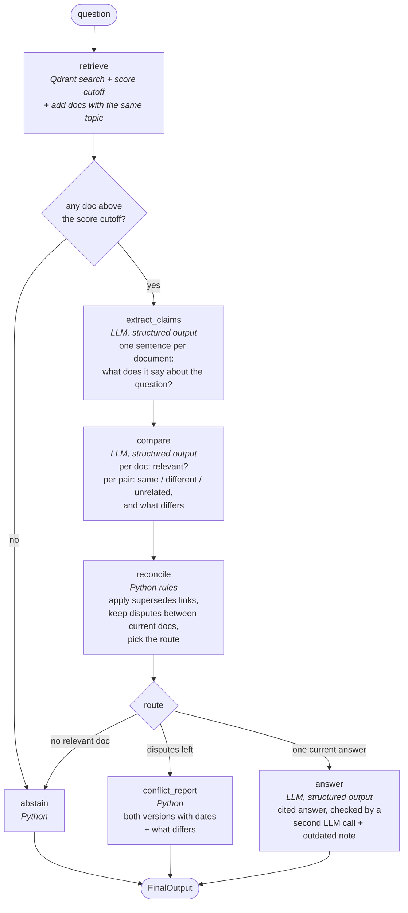

# How the pipeline works

The system answers a question from 40 internal documents. It never pretends to know more than
the documents say. There are three possible outcomes:

| outcome | when | what the user sees |
|---|---|---|
| **answered** | the documents give one current answer | the answer, each sentence cited `[Dxx]`, the sources with their creation dates, plus a note if an older, replaced version of the fact exists |
| **disputed** | two current documents give different answers and neither one officially replaces the other | both versions with document id, source and creation date, a line saying what differs, and *no* answer |
| **abstained** | no document answers the question | a short "I don't know" plus the closest documents it looked at, with dates and scores |

The main rule: **only an explicit `supersedes` link in the document metadata can make one source
win.** A newer date, a more official-looking source, or the language model's opinion never does.

## How the system tells the cases apart

| situation in the documents | what the pipeline sees | outcome |
|---|---|---|
| one document answers, or several agree | the LLM marks the claims relevant; every pair is `same` or `unrelated` | **answered**, citing them |
| an old document is replaced by a newer one (`D02 supersedes D01`) | Python finds the link in the metadata; the old one moves to "outdated", the pair is never compared | **answered** from the new one, with an "Outdated" note showing the old claim and both dates |
| two (or more) current documents give different answers, no link between them | the LLM marks each such pair `different` and says what differs | **disputed**: every version with its date, what differs, no answer |
| two documents disagree on something, but agree on what is asked | claims keep only the part that answers the question, so the LLM sees `same` | **answered**; the answer check keeps the disputed detail out |
| nothing close enough to the question | every search score is under the cutoff | **abstained**, no model call |
| documents found, but none answers the question | every claim is `null`, or the LLM marks none relevant | **abstained** |

Dates never decide anything. They are shown so the reader can see how old each version is.

## The graph

The pipeline is a LangGraph state graph. Each box is a step that reads some fields of a shared
state and writes others. Diamonds are decisions about where to go next.



One model is used, the LLM (`openai/gpt-6-luna` through OpenRouter), for four jobs: pull out
claims, compare them, write the answer, and check the answer. It is never asked "which document
is right?" and it never writes the dispute report, the outdated note or "I don't know". So it
cannot blur a contradiction into a vague middle ground.

Everything that turns its output into an outcome is plain Python with fixed rules. There is no
second model and no regex number parser (both were removed; see `decisions.md` 6, 7 and 13).

## The state

One dictionary flows through the graph. Each step adds to it.

```python
class RAGState(TypedDict):
    question: str
    retrieved: list[RetrievedDoc]      # docs in context: id, title, source, date, topic, supersedes, text, score
    best_score: float                  # best similarity score among the first hits
    closest: list[dict]                # top search hits before the cutoff: {doc_id, date, score}, for "I don't know"
    claims: dict[str, str | None]      # doc_id -> one-sentence claim, or None if the doc says nothing
    relevance: dict[str, bool]         # doc_id -> does its claim answer the question (LLM)
    pairs: list[dict]                  # {doc_a, doc_b, verdict, what_differs} for each compared pair
    relevant_ids: list[str]            # after reconcile
    outdated: list[dict]               # {old_id, old_date, old_claim, new_id, new_date}
    disputes: list[dict]               # {doc_a, doc_b, description}
    route: Literal["answer", "conflict", "abstain"]
    answer_problems: list[str]         # what the check on the answer found (after the last try)
    result: dict | None                # FinalOutput
    output: str                        # the result as text, the same as the CLI prints
```

## Step by step

### 1. `retrieve`

1. Turn the question into a vector locally (`BAAI/bge-small-en-v1.5`, 384 numbers, cosine).
2. Ask Qdrant for the 6 closest documents with scores. Keep a hit only if its score is at least
   `SCORE_THRESHOLD` (0.58) **and** at most `SCORE_MARGIN` (0.10) below the best hit. If nothing
   is left, go straight to `abstain`. No LLM call is spent.
3. **Add related docs.** This is the step that makes sure both sides of a conflict are present:
   every document with the same `topic` as a hit is added (taken from the corpus in memory, not
   found by similarity). A document and the one it `supersedes` must share a topic (the corpus
   loader stops with an error otherwise), so both ends of a `supersedes` link come in this way.
4. Remove duplicates, keep at most 10 (hits first, then the added ones, newest first).

Why add related docs: the two documents of a dispute (say "16 weeks" vs "12 weeks" of parental
leave) look almost the same to the search, so it usually finds both. But "usually" is not good
enough for a system whose whole point is to notice the second one. The topic filter makes it
certain. It really happens: for the parental leave question D03 scores 0.888 and D04 0.788, just
under the margin. D04 is dropped by the search and added back by the topic filter.

How the two numbers were chosen (`python main.py search "<q>"` prints the scores): the embedding
model gives even unrelated documents a cosine score of about 0.50 to 0.65, so no single cutoff
separates good from bad documents. The best hit of every answerable test question (including
paraphrases like "Who needs to approve my PR?") scored 0.62 or more; clearly unanswerable
questions (stock price, salary, dental cover) topped out at about 0.54. So the cutoff is 0.58.
It only throws out questions that are clearly off. The margin keeps the context small: for the
demo questions it leaves just the documents about the question (2 or 3), not ten loosely related
ones. The LLM's relevance check, not the score, is the real gate.

### 2. `extract_claims` (LLM)

One structured-output call. Input: the question and every retrieved document with its metadata.
Output, checked by Pydantic:

```json
{"claims": [
  {"doc_id": "D03", "claim": "Helios offers 16 weeks of fully paid parental leave."},
  {"doc_id": "D04", "claim": "Employees receive 12 weeks of paid parental leave."},
  {"doc_id": "D13", "claim": null}
]}
```

The prompt tells the model not to answer the question and not to judge which document is right.
It only asks for a short, literal restatement per document, with numbers copied as written.
These sentences are what the user sees in a dispute report, so they must be short and exact.

The claim keeps **only the part that answers the question**. This matters because D03 and D04
agree on many things (adoption is covered, pay is 100%, leave can be split) and disagree on one
(16 vs 12 weeks). Before this rule, "Does parental leave cover adoption?" gave the claims
"...covered by 16 weeks of fully paid parental leave" and "...employees receive 12 weeks...". The
judge used at the time saw "16 vs 12 weeks" and reported a dispute the question was not about. Now the claims
are "Every employee who becomes a parent through adoption is covered by parental leave" and
"Birth, adoption and surrogacy are treated the same way", the compare step says `same`, and the
question is answered.

### 3. `compare` (LLM)

If no document has a claim, nothing is compared and the route will be `abstain`. This is what
happens to the pets question.

Otherwise one structured-output call. Input: the question, every document that has a claim (id,
title, source, date, claim), and the list of pairs to compare: every pair of those documents
that is **not** linked by `supersedes` (Python settles those). Output, checked by Pydantic:

```json
{"docs": [{"doc_id": "D03", "relevant": true}, {"doc_id": "D04", "relevant": true}],
 "pairs": [{"doc_a": "D03", "doc_b": "D04", "verdict": "different",
            "what_differs": "D03 says 16 weeks, D04 says 12 weeks."}]}
```

The prompt asks the model to compare the claims **only as answers to the question**:

- `same`: both give the same answer; the same value written differently ("two" and "2") is the same;
- `different`: the answers cannot both be true. It must check numbers, amounts, units, dates,
  names and rules exactly, and write one short sentence that names both values;
- `unrelated`: at least one does not answer the question, or they answer different parts of it.

Details the question does not ask about do not make a pair different, and a newer date settles
nothing. The model never says which document is right.

Python then reads the reply (`read_comparison`): a pair given in the other order still matches,
a pair that was not listed is ignored, and a listed pair the model left out counts as
`unrelated` (with a warning in the log).

### 4. `reconcile` (Python rules)

This is where "outdated" and "disputed" are told apart. On purpose, this is not a model:

1. `relevant` = documents whose claim the LLM marked as relevant.
2. Build the "replaces" chains from metadata (`D02 supersedes D01`, and so on down a chain).
   Any relevant document that is replaced by another document in the corpus moves to
   `outdated`. The newest document in its chain is forced into `relevant` (the retrieve step
   already fetched it).
3. `disputes` = pairs with verdict `different` where both documents are relevant and current.
   The description of the dispute is the LLM's `what_differs` sentence.
4. Route: no relevant document → `abstain`; any dispute → `conflict`; otherwise `answer`.

Disputes in numbers ("16 vs 12 weeks", "$60 vs $75") and in words (Q8, passwords: "every 90
days" vs "no fixed schedule") are both found by the same step, because the LLM reads the claims
as sentences.

### 5a. `answer` (LLM)

Structured call. Output `{answer}`: 2 to 4 sentences, each ending with the id of its source in
square brackets. The model gets the question and the **claims** of the relevant, current
documents (with id, source and date), not the full documents. So it can only
restate what the compare step has checked.

Why: the full text of a document often holds more than the claim. For "Do I keep my salary during
parental leave?", D03 and D04 agree (full pay), but when the model saw the full documents it
wrote "...paid at 100% of your base salary for the full 16 weeks [D03]". That quietly picks D03's
side of the 16 vs 12 weeks dispute. From the claims it writes "Yes, parental leave is paid at 100%
of your base salary [D03]."

Then the answer is checked:

1. **Citations (Python).** The citations are the document ids written in the answer text
   (`[D03]`, also `[D03, D04]`), found by looking for the known ids. There must be at least one,
   and every one must be one of the allowed ids. **When documents agree, all of them are
   sources:** Python adds every allowed document that `compare` marked `same` as a cited one
   (`with_agreeing`, which follows chains: D30 = D31 and D31 = D18 brings in all three). So the
   Sources list always shows every agreeing document with its date, even if the answer text
   names only one.

   The answer answers only what is asked, but each source line shows the document's snippet as
   extracted, even if it holds other information, and nothing comments on that. For "Do I keep
   my salary during parental leave?" the answer says only that pay is 100%, while D04's source
   line reads "Employees receive 12 weeks of paid parental leave at full salary". This is on
   purpose (`decisions.md` 3b).
2. **Facts (a second LLM call).** The check gets the question, the answer, the claims and the
   full text of the current documents, and lists every problem of two kinds: a fact no claim
   states, or a value (number, amount, date, name) that the full documents give differently
   (for D03 and D04: 16 vs 12 weeks). Stating one of those values picks a side on something the
   question did not ask about. Words that name no value ("the whole period", "full pay") are
   not a problem.
3. If either check fails, the model is asked once more, told what to fix ("Fix these problems:
   States 12 weeks; D03 says 16 weeks, D04 says 12 weeks..."). After that try: if no allowed id
   is cited, the system abstains; ids that are not allowed are left out of the sources (they
   stay in the answer text). If a problem is still there, the answer is kept with a note that
   lists it.

In `demo --all` the check caught one "12 weeks" leak in an answer about parental leave; the
second try was clean, and no good answer got a note.

Python also adds the outdated note itself from the `outdated` list. The model is not trusted to
mention it.

### 5b. `conflict_report` (Python)

No model. For each dispute it prints both claims with id, source and creation date, then a
"what differs" line: both ids with their creation dates (from the metadata, added by code) and
the LLM's sentence. Then the line "Neither document is marked as replacing the other; a newer date
alone does not settle it."
`answer` stays `None`.

### 5c. `abstain` (Python)

No model. Says the documents do not cover the question and lists the closest documents with their
creation dates and scores, so a badly tuned cutoff is easy to spot.

## Three worked examples

These are real outputs of `python main.py ask` (2026-09-30), copied as printed: first the result,
then the trace of every step (shown while `SHOW_SCORES=true`).

### "How many days per week can employees work remotely?" → answered, with outdated note

```
STATUS: ANSWERED
Question: How many days per week can employees work remotely?
Employees may work remotely up to three days per week. [D02]
Sources:
  - [D02] HR Handbook (created 2025-06-15): Employees may work remotely up to three days per week.
Outdated:
  - [D01] (created 2024-03-01) said: "Employees may work remotely up to two days per week." It is
    replaced by [D02] (created 2025-06-15).
--- trace ---
retrieve       D02 0.843, D01 0.818
claim          D02: Employees may work remotely up to three days per week.
claim          D01: Employees may work remotely up to two days per week.
compare        relevant: D02 yes, D01 yes
reconcile      relevant (current): ['D02']  outdated: ['D01->D02']  route: answer
answer check   no problems
```

D02 replaces D01, so Python moves D01 to "outdated" and the pair is never sent to `compare`
(that is why no `pair` line appears). The answer is written from D02's claim only, and the
outdated note with both dates is added by code.

### "How many weeks of paid parental leave does Helios Dynamics offer?" → disputed

```
STATUS: DISPUTED
Question: How many weeks of paid parental leave does Helios Dynamics offer?
The sources disagree. Both versions:
  - [D03] HR Handbook (created 2025-01-10): Helios Dynamics offers 16 weeks of fully paid parental leave.
  - [D04] People Ops wiki (created 2025-02-20): Employees receive 12 weeks of paid parental leave at full salary.
What differs:
  - [D03] (created 2025-01-10) vs [D04] (created 2025-02-20): D03 says 16 weeks, D04 says 12 weeks.
Neither document is marked as replacing the other; a newer date alone does not settle it.
--- trace ---
retrieve       D03 0.888, D04 (related)
claim          D03: Helios Dynamics offers 16 weeks of fully paid parental leave.
claim          D04: Employees receive 12 weeks of paid parental leave at full salary.
compare        relevant: D03 yes, D04 yes
               pair D03-D04: different: D03 says 16 weeks, D04 says 12 weeks.
reconcile      relevant (current): ['D03', 'D04']  outdated: -  route: conflict
               dispute D03 vs D04: D03 says 16 weeks, D04 says 12 weeks.
```

`D04 (related)`: the search scored D04 at 0.788, just under the margin, so it was dropped by the
search and added back because it has the same topic as D03. Without that, the dispute would have
been missed. Note also that D04 is newer. The system still refuses to pick it, because nothing in
the corpus says D04 replaces D03.

### "What is the policy on bringing pets to the office?" → abstained

```
STATUS: ABSTAINED
Question: What is the policy on bringing pets to the office?
I don't know. The documents do not answer this question. None of the documents found says anything
that answers the question. Closest documents: D02 (created 2025-06-15, score 0.636), D01 (created
2024-03-01, score 0.587), D07 (created 2024-09-01, score 0.566).
--- trace ---
retrieve       D02 0.636, D01 0.587
claim          D02: None
claim          D01: None
compare        relevant: -
reconcile      relevant (current): -  outdated: -  route: abstain
```

The search cannot tell "remote work policy" from "pets policy" well (both are office rules), so
two documents pass the score gate. The claim step finds nothing about pets in either (`None`), so
there is nothing to compare (`relevant: -`), and Python routes to "I don't know". A question that
is clearly off (for example "What is the company's stock price?", best score 0.541, under the
cutoff 0.58) is stopped at the search and costs nothing.

## Why it "admits it doesn't know"

- Two gates before any answer is written: the score cutoff and the LLM's per-document
  relevance. If either one fails, the system abstains.
- For disagreement the model can only pick `same / different / unrelated` and name the two
  values. The report is built from the extracted claims by code. There is no step where a model
  could write "roughly 12 to 16 weeks".
- Newer is not the same as right. Only an explicit `supersedes` link settles a conflict, and even
  then the old value is still shown with its date.
- Every claim in every outcome carries `[doc_id] source (created date)` (the outdated note and
  "What differs" show `[doc_id] (created date)`), so each statement can be checked
  against the corpus.

## Known limits

- **A replaced document that is the only one to answer.** If D07 answers the question and D08,
  which replaces it, says nothing about it, the rules still move D07 to "outdated" and answer
  from D08. The result is an answer that says the information is missing, with D07's old claim
  in the outdated note. Example: "Is the HQ office open on weekends?".
- **One model reads everything.** The LLM decides relevance and same / different. There is no
  second opinion and no probability; the eval (run twice after a change) is the guard.
- **Tested on this corpus only.** 40 documents and 30 questions (see `evaluation.md`).

The open items are tracked in `STATUS.md`.

## Tracing and cost

Every step and every LLM call are sent to LangSmith when `LANGSMITH_TRACING=true` (off by
default; see `setup.md`). With tracing off, nothing is sent and nothing changes. One `ask` shows
up in the project `rag-conflicts` as one trace (tag `ask`, metadata `question_id`, `llm`):

```
ask
├─ retrieve
├─ extract_claims
│  └─ RunnableSequence (structured output) → ChatOpenAI
├─ compare
│  └─ RunnableSequence (structured output) → ChatOpenAI
├─ reconcile
└─ conflict_report         (or answer, with two more ChatOpenAI calls: answer and check; or abstain)
```

A full run of the five demo questions costs about $0.0011 (measured 2026-09-29, 13 LLM calls):
four calls per answered question (claims, compare, answer, check; six if the answer is retried),
two per disputed question, one when no document gives a claim, none for a question that is
dropped at retrieval.
