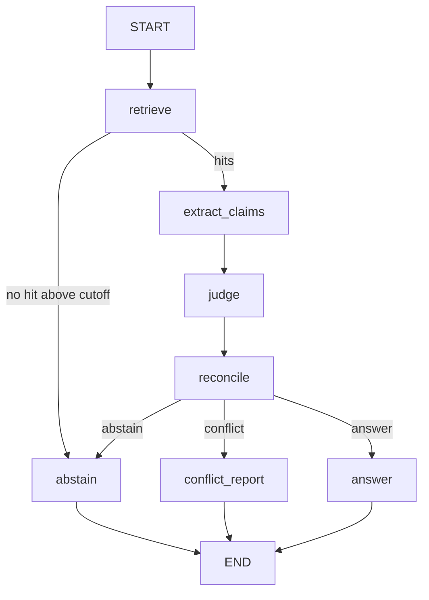

# Implementation plan: "RAG that admits it doesn't know"

> **History.** This is the plan the project started from (2026-09-29). It is kept as a record and
> is no longer up to date: the thresholds, the judge (Jev, later removed), the number check (later
> removed), the prompts, the file list and the question count have all changed since. For how the
> system works now, read [`architecture.md`](architecture.md) and [`pipeline.md`](pipeline.md);
> for what changed and why, [`decisions.md`](decisions.md) and `STATUS.md`.

## What we are building

A small RAG demo over 20 made-up markdown documents about a fictional company, *Helios Dynamics*.
Some documents contradict each other. Some are old and replaced by newer ones. The system must:

- show both versions with dates when sources disagree, and never pick one;
- prefer the newer document only when the old one is explicitly marked as replaced, and still
  mention the old one;
- say "I don't know" when nothing in the documents answers the question.

5 demo questions (2 of them disputed), a local PASS/FAIL eval, and an optional LangSmith eval.
Judged on one thing: it must work.

The repo `/home/chrzanowski/projects/AICONIC` holds only `.git`, `.env` (with `LLM_API_OR`),
`CLAUDE.md` and `docs/pipeline.md`. Python 3.12, WSL2, CPU only. Budget: $4 of OpenRouter credit.

Research and the model comparison go to `docs/research.md` and `docs/models.md` (written in M-1).
Everything below is already decided.

## Decisions (fixed)

- Packages: `langchain-core`, `langchain-openai`, `langchain-qdrant`, `langgraph`, `langsmith`,
  `qdrant-client`, `fastembed`, `python-frontmatter`, `python-dotenv`, `httpx`. Versions pinned
  below.
- LLM for writing text: `openai/gpt-6-luna` through `ChatOpenAI(base_url="https://openrouter.ai/api/v1")`,
  key from `LLM_API_OR`.
- Judge for decisions (is a doc relevant? do two claims disagree?): Jev `typesafe/jev-1.13`
  through OpenRouter's Decisions API (`POST https://openrouter.ai/api/alpha/decisions`), same key.
  If Jev fails, the LLM does the judging with structured output.
- Embeddings: `BAAI/bge-small-en-v1.5` through FastEmbed (ONNX, 384 numbers, cosine), wrapped in a
  small `langchain_core.embeddings.Embeddings` class.
- Retrieval: Qdrant vector search (k=6, score cutoff), then add every doc with the same `topic`
  and every doc linked by `supersedes`.
- No reranker, no BM25/hybrid search, no NLI model, no web search.
- Qdrant runs embedded (`path=./qdrant_data`) by default; `QDRANT_MODE=server` switches to a
  server. Collection name `helios_docs`.
- Only an explicit `supersedes` link in metadata can settle a conflict. A newer date never does.
- The dispute report, the outdated note and the "I don't know" text are built by Python from the
  extracted claims. The LLM never writes them.
- One module, `config.py`, holds every setting. No other module reads `os.environ`.
- Plain English everywhere: docs, comments, commit messages, CLI output, prompts.

## Repo rules (from the first commit)

- Remote: `git remote add origin git@github.com:chrzanowski000/AICONIC-CRAG.git`,
  `git branch -M main`, `git push -u origin main`. Push after every milestone and after every
  `STATUS.md` update.
- Conventional Commits (`feat:`, `fix:`, `docs:`, `chore:`, `test:`, `refactor:`), imperative,
  subject 72 characters or less. **Never mention Claude, AI, assistants or AI co-authorship in
  commit messages, code, comments, docs or any repo text.** No `Co-Authored-By` trailer.
- `CLAUDE.md` (exists): rules first, then the project guide. Update it whenever structure,
  commands or rules change; at least once per milestone.
- `STATUS.md`: milestone checklist (done / in progress / to do), last verified command outputs,
  next step, known issues, money spent so far. Update it before every commit.
- `docs/` describes the repo: `setup.md`, `architecture.md`, `pipeline.md` (exists), `corpus.md`,
  `evaluation.md`, `research.md`, `models.md` (+ `models_price_vs_score.png`), `decisions.md`.
  Each is written when its milestone lands and kept up to date after.
- The documents live in `data/corpus/`, not in `docs/`.

## Tech setup

**`requirements.txt`** (versions checked on PyPI 2026-09-29; pin `pydantic` and `httpx` from
`pip freeze` in M0):
```
langchain-core==1.6.5
langchain-openai==1.6.6
langchain-qdrant==1.1.0
langgraph==1.2.12
langsmith==0.14.1
qdrant-client==1.19.1
fastembed==0.8.1
python-frontmatter==1.3.0
python-dotenv==1.2.3
```
`requirements-dev.txt`: `matplotlib` (only for `docs/models_price_vs_score.png`).

**Embeddings** — `src/embeddings.py`: `FastEmbedDense(Embeddings)` around
`fastembed.TextEmbedding(config.EMBEDDING_MODEL, cache_dir=config.MODELS_CACHE_DIR)` with
`embed_documents` / `embed_query`. Vectors are already normalized. Other option:
`EMBEDDING_BACKEND=huggingface` → `langchain_huggingface.HuggingFaceEmbeddings` (not installed by
default).

**Qdrant** — `src/vectorstore.py`:
- `get_client()` returns one client per process: `QdrantClient(path=config.QDRANT_PATH)` or
  `QdrantClient(url=config.QDRANT_URL, api_key=...)`. Closed on exit with `atexit`. If Qdrant says
  the folder is "already accessed by another instance", re-raise with a clear message: close the
  other process, or delete the old `qdrant_data/.lock`, or use `QDRANT_MODE=server`.
- Collection: `VectorParams(size=config.EMBEDDING_DIM, distance=Distance.COSINE)`. Payload is
  `{"page_content", "metadata": {id, title, source, date, topic, supersedes}}` (the
  langchain-qdrant default). Keyword indexes on `metadata.topic` and `metadata.id`.
- Point id = `uuid5(NAMESPACE_URL, doc_id)`, so writing the same doc twice is safe.
- When to rebuild the index: sha256 of all corpus files is stored in `qdrant_data/corpus.sha256`.
  Rebuild when the collection is missing, the point count differs from the file count, the hash
  changed, or `--reindex` / `QDRANT_FORCE_REINDEX` is set.
- `retrieve(question)`: `similarity_search_with_score(k=TOP_K)` → drop scores below
  `SCORE_THRESHOLD` → add related docs: `client.scroll` with
  `Filter(must=[FieldCondition(key="metadata.topic", match=MatchAny(any=topics))])`, plus docs
  linked by `supersedes` in either direction (from the in-memory doc map) → remove duplicates →
  keep at most `MAX_CONTEXT_DOCS` (hits first, then the added ones, newest first).

**LLM** — `src/llm.py`:
```python
ChatOpenAI(
    model=config.LLM_MODEL, base_url=config.LLM_BASE_URL, api_key=config.LLM_API_KEY,
    use_responses_api=False,
    reasoning_effort=config.LLM_REASONING_EFFORT or None,   # never send temperature to the GPT-5/6 family
    max_tokens=config.LLM_MAX_TOKENS, timeout=config.LLM_TIMEOUT_S, max_retries=config.LLM_MAX_RETRIES,
    extra_body={"provider": {"require_parameters": config.LLM_REQUIRE_PARAMETERS, **({"order": order} if order else {})}},
    default_headers={"HTTP-Referer": config.LLM_HTTP_REFERER, "X-Title": config.LLM_APP_TITLE},
)
```
`structured(llm, Model)`: try the methods in `config.LLM_STRUCTURED_METHODS`, in order:
`json_schema` with `strict=True` → `function_calling` → `json_mode` + `Model.model_validate_json`
(one retry with the error message fed back). Log which method worked. Every call adds its
`usage_metadata` to a running total; tokens and cost are printed at the end of each CLI run and
added to the "spent" line in `STATUS.md`.

**Jev judge** — `src/jev.py` (httpx, header `Authorization: Bearer <LLM_API_OR>`):
```python
request = {
  "model": config.JEV_MODEL,
  "state": {"question": q, "documents": [{"id": "D03", "source": ..., "date": ..., "claim": ...}, ...]},
  "questions": {
    "rel_D03": {"type": "noul", "instructions": "Does document D03 directly answer the question? Its claim: <claim>"},
    "pair_D03_D04": {"type": "choice",
      "instructions": "Compare the claims of D03 and D04 as answers to the question. Different dates or sources do NOT make claims agree or disagree; only their content does.",
      "criteria": {"agree": "Both give the same answer (same values or rules)",
                   "disagree": "They give answers that cannot both be true (different numbers, names or rules)",
                   "unrelated": "At least one does not answer the question"}}}}
# response
{"answers": {"rel_D03": {"type": "noul", "noul": 0.96},
             "pair_D03_D04": {"type": "choice", "choice": "disagree", "confidence": 0.67,
                              "probabilities": {"agree": 0.10, "disagree": 0.78, "unrelated": 0.12}}},
 "id": "gen-dec-...", "model": "typesafe/jev-1.13-20260917", "provider": "TypeSafe",
 "usage": {"input_tokens": 476, "output_tokens": 70, "cost": 0.00002}}
```
One call per question: one `rel_<id>` for every doc with a claim, one `pair_<a>_<b>` for every
pair of those docs that is not linked by `supersedes`. Pydantic models `JevRequest` /
`JevResponse`. Wrapped in `@traceable(name="jev_judge")` with `usage.cost` as metadata. Any error,
timeout or bad response → the LLM judges instead (`JUDGE_FALLBACK=llm`), and this is logged.

**LangSmith** — only through env vars (`LANGSMITH_TRACING`, `LANGSMITH_API_KEY`,
`LANGSMITH_PROJECT`). Graph runs are called with
`config={"run_name": "ask", "tags": ["demo"], "metadata": {"question_id": ..., "judge": ...}}`.
`eval.py` uses `langsmith.Client` only when tracing is on.

### `config.py` — every setting

A plain module: `X = env("X", default, cast)`. `.env` is loaded on import with python-dotenv.
`python main.py config` prints the values in use (secrets hidden).

| group | variable (env name is the same) | default |
|---|---|---|
| keys | `LLM_API_OR` (or `OPENROUTER_API_KEY`) → `LLM_API_KEY` | — |
| LLM | `LLM_MODEL` | `openai/gpt-6-luna` |
| | `LLM_BASE_URL` | `https://openrouter.ai/api/v1` |
| | `LLM_REASONING_EFFORT` (empty = don't send) | `low` |
| | `LLM_TEMPERATURE` (empty = don't send) | empty |
| | `LLM_MAX_TOKENS`, `LLM_TIMEOUT_S`, `LLM_MAX_RETRIES` | 1500, 90, 3 |
| | `LLM_REQUIRE_PARAMETERS` | true |
| | `LLM_PROVIDER_ORDER` (comma list) | empty |
| | `LLM_STRUCTURED_METHODS` | `json_schema,function_calling,json_mode` |
| | `LLM_APP_TITLE`, `LLM_HTTP_REFERER` | `rag-conflicts`, `local-demo` |
| judge | `JUDGE` (`jev` \| `llm`) | `jev` |
| | `JUDGE_FALLBACK` (`llm` \| `none`) | `llm` |
| | `JEV_MODEL` | `typesafe/jev-1.13` |
| | `JEV_URL` | `https://openrouter.ai/api/alpha/decisions` |
| | `JEV_TIMEOUT_S` | 30 |
| | `JEV_RELEVANT_P` | 0.6 |
| | `JEV_DISAGREE_P` | 0.6 |
| | `NUMERIC_BACKSTOP` | true |
| embeddings | `EMBEDDING_BACKEND` (`fastembed` \| `huggingface`) | `fastembed` |
| | `EMBEDDING_MODEL` | `BAAI/bge-small-en-v1.5` |
| | `EMBEDDING_DIM` | 384 |
| | `MODELS_CACHE_DIR` | `./models` |
| retrieval | `TOP_K` | 6 |
| | `SCORE_THRESHOLD` | 0.45 |
| | `MAX_CONTEXT_DOCS` | 10 |
| | `EXPAND_BY_TOPIC`, `EXPAND_BY_SUPERSEDES` | true, true |
| qdrant | `QDRANT_MODE` (`embedded` \| `server`) | `embedded` |
| | `QDRANT_PATH` | `./qdrant_data` |
| | `QDRANT_URL`, `QDRANT_API_KEY` | `http://localhost:6333`, empty |
| | `QDRANT_COLLECTION` | `helios_docs` |
| | `QDRANT_DISTANCE` | `COSINE` |
| | `QDRANT_FORCE_REINDEX` | false |
| corpus | `CORPUS_DIR` | `./data/corpus` |
| | `QUESTIONS_FILE` | `./questions.json` |
| langsmith | `LANGSMITH_TRACING`, `LANGSMITH_API_KEY`, `LANGSMITH_PROJECT` (copied for display) | false, empty, `rag-conflicts` |
| eval | `EVAL_DATASET_NAME`, `EVAL_EXPERIMENT_PREFIX`, `EVAL_MAX_CONCURRENCY` | `rag-conflicts-demo`, `rag-conflicts`, 1 |
| output | `SHOW_SCORES`, `LOG_LEVEL` | true, `INFO` |
| budget | `BUDGET_USD` (warn when total spend goes over) | 4.0 |

## The documents

Format, e.g. `data/corpus/D01_remote_work_v1.md`:
```markdown
---
id: D01
title: Remote Work Policy (v1)
source: HR Handbook
date: 2024-03-01
topic: remote-work
supersedes: null
---
Employees may work remotely up to two days per week ...
```
`load_docs.py`: python-frontmatter → `Document(page_content, metadata)`. Checks that ids are
unique, `supersedes` targets exist, and dates parse. Gives back `doc_map` (id → metadata) and
`corpus_hash()`.

| id | title | source | date | topic | supersedes | key fact | role |
|---|---|---|---|---|---|---|---|
| D01 | Remote Work Policy (v1) | HR Handbook | 2024-03-01 | remote-work | – | up to 2 remote days/week | old |
| D02 | Remote Work Policy (v2) | HR Handbook | 2025-06-15 | remote-work | D01 | up to 3 remote days/week | replaces D01 |
| D03 | Parental Leave Policy | HR Handbook | 2025-01-10 | parental-leave | – | 16 weeks paid | dispute A |
| D04 | Benefits FAQ | People Ops wiki | 2025-02-20 | parental-leave | – | 12 weeks paid | dispute A |
| D05 | Travel & Expense Policy | Finance | 2025-04-01 | travel-expenses | – | meals $60/day | dispute B |
| D06 | Travel Team Update | #travel Slack digest | 2025-05-12 | travel-expenses | – | meals $75/day | dispute B |
| D07 | HQ Office Information | Facilities | 2024-09-01 | offices | – | HQ at 12 Harbor St | old |
| D08 | HQ Relocation Notice | Facilities | 2025-08-01 | offices | D07 | HQ at 400 Meridian Ave | replaces D07 |
| D09 | Kestrel X2 Datasheet v1 | Product | 2024-11-05 | kestrel-x2 | – | flight time 38 min | old |
| D10 | Kestrel X2 Datasheet v2 | Product | 2025-07-20 | kestrel-x2 | D09 | flight time 45 min | replaces D09 |
| D11 | Password Policy | IT Security | 2025-03-15 | security | – | change every 90 days | dispute C (spare) |
| D12 | IT Announcement: password rotation | #it-announcements | 2025-03-30 | security | – | forced change dropped | dispute C (spare) |
| D13 | Onboarding Checklist | People Ops | 2025-02-01 | onboarding | – | laptop day 1, buddy week 1 | filler |
| D14 | Code Review Guidelines | Engineering wiki | 2025-05-05 | engineering | – | 2 approvals to merge | clean answer |
| D15 | Incident Response Process | Engineering wiki | 2025-01-20 | engineering | – | Sev1 ack within 15 min | filler |
| D16 | Holiday Calendar 2025 | HR Handbook | 2025-01-02 | holidays | – | 11 public holidays | filler |
| D17 | Company Overview | Comms | 2024-06-10 | company | – | founded 2019, Tallinn | filler |
| D18 | Kestrel X2 Product Overview | Product | 2025-07-20 | kestrel-x2 | – | 1.2 kg, 300 g payload | filler |
| D19 | Customer Support SLA | Support | 2025-03-01 | support | – | first reply within 4 business hours | filler |
| D20 | On-call Rotation | Engineering wiki | 2025-04-10 | engineering | – | weekly rotation, comp day | filler |

Rules: the two docs of a dispute never mention each other. A doc that replaces another says
"this replaces the {date} version" in its text as well as in metadata. About 100–200 words each.
Nothing about pets (that is the no-answer question).

## LangGraph pipeline

Full walkthrough with a diagram and worked examples: `docs/pipeline.md`.

### State
```python
class RetrievedDoc(TypedDict):
    doc_id: str; title: str; source: str; date: str; topic: str
    supersedes: str | None; text: str; score: float | None      # None = added as a related doc

class RAGState(TypedDict):
    question: str
    retrieved: list[RetrievedDoc]
    best_score: float
    claims: dict[str, str | None]            # doc_id -> claim or None
    judge_used: Literal["jev", "llm"]
    relevance: dict[str, float]              # doc_id -> p(relevant) (LLM judge: 1.0 / 0.0)
    pairs: list[dict]                        # {doc_a, doc_b, relation, p_disagree}
    relevant_ids: list[str]
    outdated: list[dict]                     # {old_id, old_date, old_claim, new_id, new_date}
    disputes: list[dict]                     # {doc_a, doc_b, description}
    route: Literal["answer", "conflict", "abstain"]
    result: dict | None                      # FinalOutput.model_dump()
```

### Steps
| step | reads → writes | what it does |
|---|---|---|
| `retrieve` | question → retrieved, best_score | `vectorstore.retrieve()` (search + cutoff + related docs + cap) |
| `extract_claims` (LLM) | question, retrieved → claims | structured `Claims`: one sentence per doc, values copied as written, null if the doc says nothing about the question |
| `judge` | question, retrieved, claims → judge_used, relevance, pairs | `JUDGE=jev`: one Decisions call (rel + pair questions). `JUDGE=llm` or fallback: structured `Assessment` mapped onto the same fields (relevant → 1.0/0.0, listed conflicts → p_disagree 1.0) |
| `reconcile` (Python) | claims, relevance, pairs, retrieved → relevant_ids, outdated, disputes, route | relevant = p ≥ `JEV_RELEVANT_P`. Build "replaces" chains from metadata: a relevant doc that is replaced (also through a chain) by a corpus doc → `outdated`; the newest doc of the chain is forced into relevant. Disputes = pairs with p_disagree ≥ `JEV_DISAGREE_P`, both relevant, neither outdated, not in the same chain. Number check (`NUMERIC_BACKSTOP`): two relevant current same-topic claims with different numbers and no dispute recorded → add one, "numeric mismatch (backstop)". Route: none relevant → abstain; any dispute → conflict; else answer |
| `answer` (LLM) | question, relevant current docs → result | structured `Answer{answer, citations}`; Python drops citations not in relevant_ids, asks once more if none are left, else abstains; Python adds the outdated note |
| `conflict_report` (Python) | disputes, claims, retrieved → result | both versions per dispute: id, source, date, claim; "Neither document is marked as replacing the other; a newer date alone does not settle it." |
| `abstain` (Python) | retrieved, best_score → result | "not answerable from the documents" + the closest doc ids and scores |

### Edges

`add_conditional_edges("retrieve", lambda s: "abstain" if not s["retrieved"] else "extract_claims", {...})`;
`add_conditional_edges("reconcile", lambda s: s["route"], {"answer": "answer", "conflict": "conflict_report", "abstain": "abstain"})`.

### Output
```python
class Citation(BaseModel):     doc_id: str; date: str; source: str; claim: str
class OutdatedNote(BaseModel): old_id: str; old_date: str; old_claim: str; new_id: str; new_date: str
class FinalOutput(BaseModel):
    status: Literal["answered", "disputed", "abstained"]
    answer: str | None = None            # answered only
    citations: list[Citation] = []       # answered: at least 1
    versions: list[Citation] = []        # disputed: at least 2
    outdated: list[OutdatedNote] = []
    reason: str | None = None
```
`render.py` prints, for example:
```
STATUS: DISPUTED
Question: How many weeks of paid parental leave ...
The sources disagree. Both versions:
  - [D03] HR Handbook (2025-01-10): 16 weeks of paid parental leave.
  - [D04] Benefits FAQ (2025-02-20): 12 weeks of paid parental leave.
Neither document is marked as replacing the other; a newer date alone does not settle it.
```

## Schemas and prompts

```python
class DocClaim(BaseModel):
    doc_id: str
    claim: str | None = Field(description="What this document says in answer to the question, in one sentence, with numbers, amounts, dates and names copied exactly as written; null if the document says nothing about the question")
class Claims(BaseModel):
    claims: list[DocClaim]

class Answer(BaseModel):
    answer: str = Field(description="2-4 sentences; every factual statement ends with the id of its source document in square brackets, e.g. [D14]")
    citations: list[str] = Field(description="doc ids actually used")

# LLM judge (fallback) only
class DocAssessment(BaseModel):
    doc_id: str
    relevant: bool = Field(description="True only if the document says something that directly answers the question")
class Conflict(BaseModel):
    doc_a: str; doc_b: str; description: str
class Assessment(BaseModel):
    docs: list[DocAssessment]
    conflicts: list[Conflict] = Field(description="Every pair of RELEVANT documents whose claims cannot both be true")
```

EXTRACT_CLAIMS (system):
```
You pull claims out of documents for a question-answering system. You never answer the question
yourself and never judge which document is right.
For EACH document, say in one sentence what that document says in answer to the question, copying
numbers, amounts, dates and names exactly as written. If a document says nothing about the
question, return null for it. Return only the structured object.
```
human: `Question: {question}\n\nDocuments:\n{docs}` — each doc shown as
`### [D03] Parental Leave Policy — source: HR Handbook — date: 2025-01-10 — supersedes: none\n<text>`.

ASSESS (LLM judge fallback, system):
```
You check retrieved documents for a question-answering system. You never answer the question
yourself.
For EACH document decide whether it directly answers the question (relevant).
Then compare every pair of relevant documents. If two documents give answers that cannot both be
true (different numbers, different names, opposite rules), list the pair under conflicts. Do NOT
settle conflicts, do NOT guess which is right, and do NOT treat a newer date as settling anything.
Known "replaces" links (already handled, do NOT list them as conflicts): {supersession_facts}
Return only the structured object.
```
human: `Question: {question}\n\nDocuments with their claims:\n{docs_with_claims}`.

ANSWER (system):
```
Answer the question using ONLY the documents below. Every factual statement must end with the id
of the document it comes from in square brackets, e.g. [D14]. If the documents do not fully answer
the question, say what is missing instead of guessing. Do not mention documents that are not
listed.
```
human: `Question: {question}\n\nDocuments:\n{relevant_docs}`.

If things break: if `Claims` cannot be parsed after all methods → use the first 300 characters of
each doc as its claim (the judge still runs). If `Answer` cannot be parsed → use the raw text,
citations = whatever matches `\[D\d\d\]`.

## Demo questions and eval

`questions.json`:

| id | question | expected |
|---|---|---|
| Q1 | How many approvals does a pull request need before it can be merged? | `answered`; cites D14; answer contains "2" or "two" |
| Q2 | How many days per week can employees work remotely? | `answered`; cites D02; outdated has D01→D02 with both dates; answer contains "3" or "three" |
| Q3 | How many weeks of paid parental leave does Helios Dynamics offer? | `disputed`; versions include D03 and D04, each with a date; answer is None |
| Q4 | What is the daily meal allowance for business travel? | `disputed`; versions include D05 and D06, each with a date |
| Q5 | What is the policy on bringing pets to the office? | `abstained`; no citations, no versions |
| Q6 (extra) | What is the Kestrel X2 flight time? | `answered`; cites D10; outdated D09→D10 |
| Q7 (extra) | Where is the headquarters located? | `answered`; cites D08; outdated D07→D08 |

Check functions (shared; signature `(inputs, outputs, reference_outputs) -> {"key", "score", "comment"}`
so they also work as LangSmith evaluators): `status_matches`, `cites_required_docs`,
`disputed_shows_both_sides` (2+ different versions, each with date and claim, answer None),
`marks_outdated`, `abstained_cleanly`, `answer_contains`.

`eval.py`: builds the graph once, runs all questions, prints a `Qx PASS/FAIL <reason>` table and
a summary, exits with code 1 on any FAIL, prints tokens and cost. Needs no LangSmith setup. When
`LANGSMITH_TRACING=true` and a key is set: dataset `EVAL_DATASET_NAME` (read → on error
`create_dataset` + `create_examples(dataset_id=..., examples=[{"inputs", "outputs"}])`), then
`client.evaluate(target, data=..., evaluators=[...], experiment_prefix=f"{EVAL_EXPERIMENT_PREFIX}-{JUDGE}", max_concurrency=EVAL_MAX_CONCURRENCY)`
and print the experiment URL.

## Files

```
AICONIC/
  CLAUDE.md               # rules first, then the project guide
  STATUS.md               # milestone checklist, verified outputs, next step, known issues, money spent
  README.md               # install, env, commands
  requirements.txt / requirements-dev.txt
  .env.example            # LLM_API_OR, LLM_MODEL, JUDGE, QDRANT_MODE, LANGSMITH_*
  .gitignore              # .venv, qdrant_data/, models/, .env, __pycache__
  config.py               # the one settings module
  main.py                 # CLI: config | index [--reindex] | search "<q>" | llm-test | jev-test | ask "<q>" | demo
  eval.py                 # local PASS/FAIL + optional LangSmith eval
  questions.json
  data/corpus/D01_*.md … D20_*.md
  docs/
    setup.md  architecture.md  pipeline.md  corpus.md  evaluation.md
    research.md  models.md  models_price_vs_score.png  decisions.md
  src/
    __init__.py
    load_docs.py          # frontmatter → Document, checks, corpus hash, doc map
    embeddings.py         # FastEmbedDense(Embeddings)
    vectorstore.py        # client, collection, index/reuse, retrieve + related docs
    llm.py                # ChatOpenAI setup, structured() with fallbacks, token/cost counting
    jev.py                # Decisions API client, question builder, response → relevance/pairs
    schemas.py            # Pydantic models
    prompts.py            # prompt templates
    graph.py              # RAGState, steps, build_graph()
    render.py             # FinalOutput → terminal text
```

## Build order

Every milestone ends with: update `STATUS.md` (and `CLAUDE.md` / `docs/` if anything changed) →
conventional commit → `git push`.

- **M-1 – Repo bootstrap**: remote and branch; `STATUS.md`, `.gitignore`, `README.md` stub;
  `docs/research.md`, `docs/models.md` (+ PNG with matplotlib), `docs/decisions.md`,
  `docs/architecture.md` from the research already done. First push.
- **M0 – Documents + index + retrieval test** (no LLM): venv, requirements, `.env.example`,
  `config.py`, the 20 docs, `load_docs.py`, `embeddings.py`, `vectorstore.py`,
  `main.py index|search|config`, `docs/setup.md`, `docs/corpus.md`. `python main.py index` → 20
  points; `python main.py search "parental leave"` → scores + related docs; set `SCORE_THRESHOLD`
  from the gap between good and bad scores. Pin `pydantic` / `httpx` from `pip freeze`.
- **M1 – LLM + Jev + LangSmith tests**: `llm.py`, `jev.py`, `schemas.py`; `main.py llm-test`
  (one `Claims` round trip: method used, tokens, cost, time); `main.py jev-test` (fixed 2-doc
  state with one agreeing and one disagreeing pair: probabilities + cost). Turn on
  `LANGSMITH_TRACING=true` and check both traces show up.
- **M2 – Graph v1**: `prompts.py`, `graph.py` (retrieve → extract_claims → judge → reconcile →
  answer | abstain), `render.py`, `main.py ask`. Q1 and Q5 pass. Update `docs/pipeline.md` if
  anything differs from the plan.
- **M3 – Conflicts + replaced docs**: pair questions, reconcile rules, `conflict_report`, outdated
  note, number check. Q2–Q4 pass; `main.py demo` runs all. Tune `JEV_RELEVANT_P` /
  `JEV_DISAGREE_P` from the printed probabilities.
- **M4 – Eval**: `eval.py` locally (both `JUDGE=jev` and `JUDGE=llm` must pass), then the LangSmith
  dataset and evaluators. `docs/evaluation.md`.
- **M5 – Hardening + docs**: force the structured-output method order to test the fallbacks;
  point `JEV_URL` at a bad URL to test the judge fallback; check the stale-lock message; try
  `QDRANT_MODE=server` against Docker Qdrant if available; README and a last pass over
  `CLAUDE.md`, `STATUS.md`, `docs/`.

## Risks and what we do about them

| risk | what we do |
|---|---|
| The LLM blurs a contradiction into a vague answer | The LLM never decides or writes disputes: Jev decides, Python builds the report from the claims; number check; eval requires `answer is None` when disputed |
| Retrieval misses one side of a conflict | Related docs are added by topic and by `supersedes` after the search; checked in M0 |
| Score cutoff set badly | The cutoff is only a first filter; the judge's relevance is the real gate; the abstain output lists the closest docs so a bad cutoff is easy to see |
| Newer doc wrongly preferred | Only an explicit `supersedes` link settles it; Q3/Q4 have the newer doc on the "wrong" side on purpose |
| Jev API (alpha) errors, format changes, limits | Any error → LLM judge, `judge_used` is logged; Pydantic parsing fails loudly; the observed format is written into `docs/pipeline.md` after `jev-test` |
| Jev thresholds set badly | Probabilities are printed and traced; thresholds live in config; number check + supersedes rules as safety net |
| Embedded Qdrant lock | One client per process, closed on exit, clear error message, `EVAL_MAX_CONCURRENCY=1`, server mode switch |
| OpenRouter routes to a host that ignores `response_format` | `require_parameters=true`; fall back to function_calling / json_mode + Pydantic; citations are checked |
| GPT-6 family rejects `temperature` | Not sent by default; `reasoning_effort=low`; `use_responses_api=False`; the model is one config value |
| Spending the $4 | `LLM_MAX_TOKENS=1500`, low reasoning effort, cost printed per run and logged in `STATUS.md`, warning past `BUDGET_USD`; M0 uses no LLM |
| Made-up citations | Checked against relevant_ids; one retry; else abstain |
| Index out of date after editing docs | Corpus hash stored next to the index → automatic rebuild |
| FastEmbed/ONNX install trouble | `EMBEDDING_BACKEND=huggingface` fallback (same model, same 384 numbers) |

## How to check it works

1. `python main.py index && python main.py search "parental leave"` → 20 points; D03 and D04 both
   in the result with scores.
2. `python main.py llm-test` → valid `Claims` + method used; `python main.py jev-test` →
   probabilities + cost; with tracing on, both traces show up; `python main.py config` prints all
   settings.
3. `python main.py demo` → Q1 answered citing [D14]; Q2 answered citing [D02] with the note
   D01 (2024-03-01) → D02 (2025-06-15); Q3/Q4 `STATUS: DISPUTED` with two dated versions and no
   answer; Q5 `STATUS: ABSTAINED`.
4. `python eval.py` → all PASS, exit 0, for `JUDGE=jev` and `JUDGE=llm`; with tracing on, a
   LangSmith experiment where every check scores 1.
5. `QDRANT_MODE=server` with `docker run -p 6333:6333 qdrant/qdrant` → same demo output.
